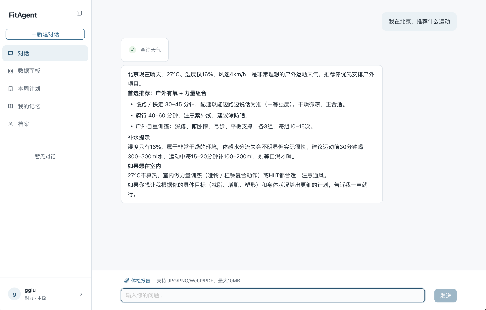
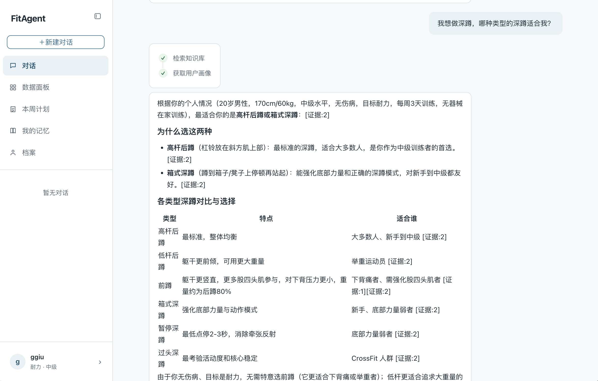
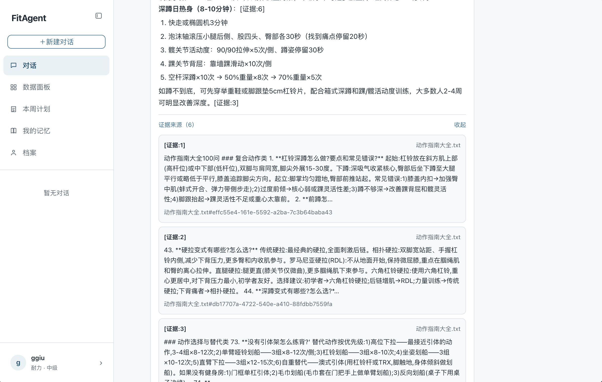
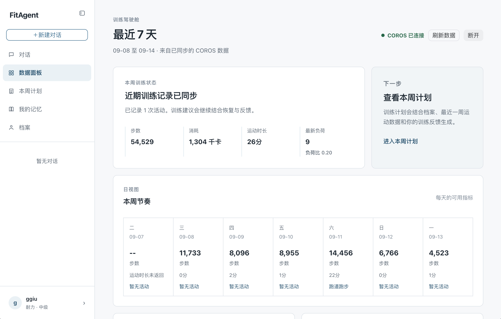
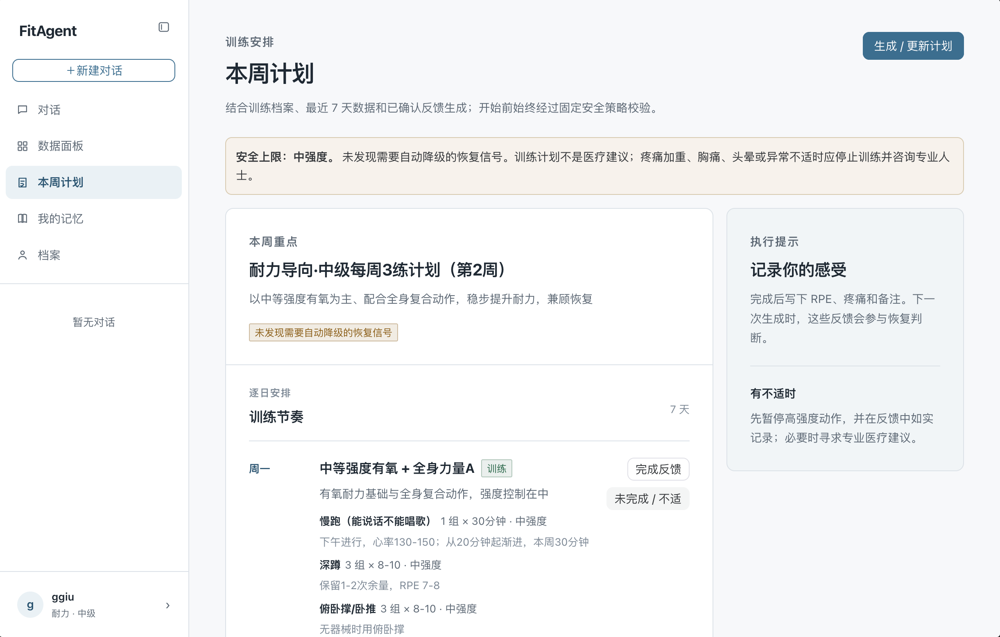
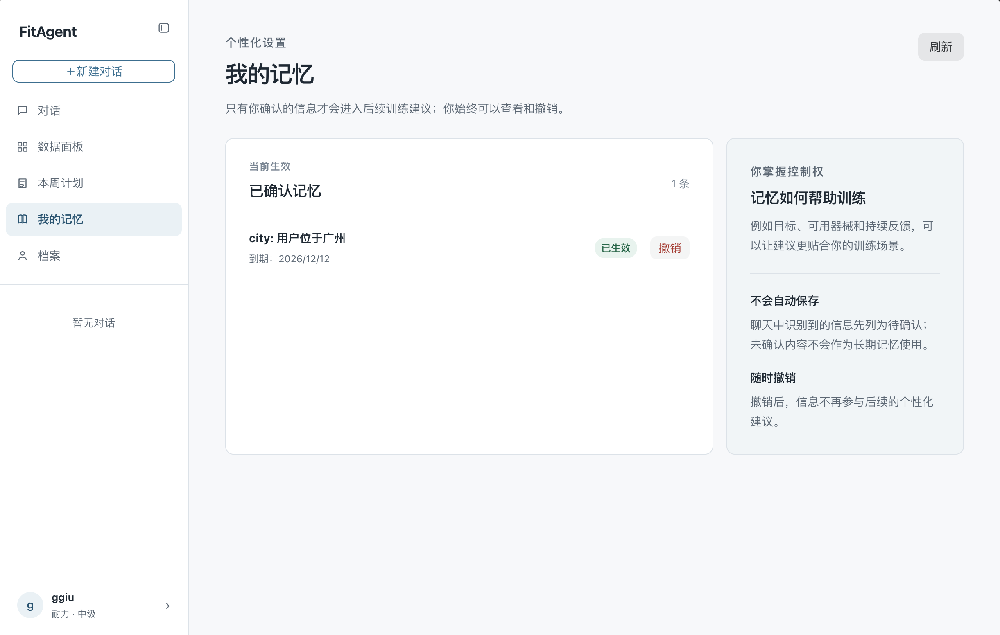
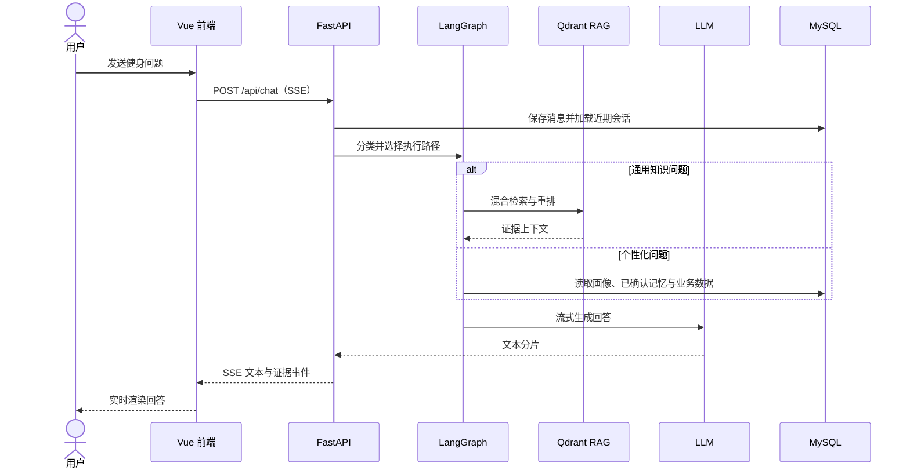
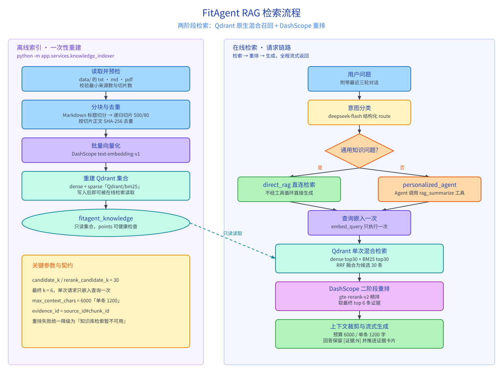

# FitAgent

面向健身场景的 AI 智能教练全栈项目。系统结合 RAG、受控 Agent、长期记忆与运动数据，提供流式健身问答、个性化训练计划、健康报告解析和 COROS 实时数据看板等能力。

## 界面预览

### 1. 天气感知训练建议

<p align="center">
  
</p>

Agent 会调用实时天气工具，结合温度、湿度和风力，为用户给出户外或室内训练建议，以及对应的补水与防晒提醒。

### 2. RAG 与用户画像驱动的个性化对话

<p align="center">
  
</p>

对话会按需检索训练知识库并读取用户画像，综合训练水平、目标、器械条件和身体状况，给出适合个人的动作选择与训练建议。

### 3. 可追溯的 RAG 证据卡片

<p align="center">
  
</p>

回答中的引用可展开为证据卡片，展示命中的知识库文档和相关片段，帮助用户核对训练结论的来源。

### 4. COROS 训练数据看板

<p align="center">
  
</p>

连接 COROS 后，可同步近 7 天的步数、运动时长、消耗和训练负荷，以日视图汇总近期训练节奏。

### 5. 基于数据生成的本周计划

<p align="center">
  
</p>

系统基于训练档案、近期运动数据与已确认反馈生成周计划，并将安全上限、每日训练内容和完成反馈集中呈现。

### 6. 用户可控的长期记忆

<p align="center">
  
</p>

只有经用户确认的信息才会进入长期记忆；用户可随时查看、生效或撤销记忆，确保个性化建议始终由用户掌控。

## 项目模块

```text
app/        后端服务（FastAPI + LangGraph + MySQL + Qdrant）
frontend/   Web 前端（Vue 3 + Vite + Naive UI）
config/     模型、检索与知识源配置
prompts/    Agent 与任务提示词
data/       离线构建的健身知识库源文件
```

| 模块 | 技术栈 | 说明 |
| --- | --- | --- |
| `app` | FastAPI、LangChain、LangGraph、SQLAlchemy、MySQL | REST API、JWT 认证、SSE 流式聊天、Agent 编排与训练业务 |
| `frontend` | Vue 3、Vite、Pinia、Naive UI、ECharts | 健身对话、训练计划、健康画像、记忆管理与数据看板 |
| RAG 与记忆 | Qdrant、DashScope、mem0 | Dense + BM25 混合检索、重排、证据引用与用户确认的长期记忆 |
| 外部集成 | DeepSeek、DashScope、COROS MCP | 聊天/视觉模型、Embedding/重排与 OAuth 授权后的实时运动数据读取 |

## 核心功能

- **AI 健身对话**：通过 SSE 实时输出回答；普通知识问题走快速 RAG，个性化问题进入 LangGraph Agent。
- **可解释 RAG**：Dense 与 BM25 召回经 RRF 融合、DashScope 重排后生成回答，并返回可追溯的证据卡片。
- **个性化训练计划**：结合用户画像、已确认记忆、知识证据和安全策略生成周训练计划。
- **用户可控记忆**：从用户消息中提取候选记忆，只有用户确认后才可跨会话被 Agent 检索使用。
- **健康报告解析**：支持 PDF 与图片健康文档解析，识别结果须经用户确认后写入健康画像，不提供医疗诊断。
- **COROS 数据看板**：通过 OAuth 和官方远程 MCP 按需读取健康、睡眠与活动数据，不在本地持久化原始运动数据。
- **运行可观测性**：记录聊天请求的分段耗时，以及 Agent 工具调用与执行轨迹，便于定位性能和调用问题。

## 整体架构

```text
┌──────────────────────────────────────────────────┐
│                  frontend                         │
│ Vue 3 + Pinia + Naive UI + ECharts                │
└────────────────────┬─────────────────────────────┘
                     │ HTTP REST + SSE
                     ▼
┌──────────────────────────────────────────────────┐
│                  FastAPI Backend                  │
│  Chat Router ──> LangGraph 路由 ──> Direct RAG    │
│                         └──────────> ReAct Agent  │
│  认证 / 画像 / 记忆 / 训练计划 / 文档解析 / COROS │
└───────┬─────────────────┬─────────────────┬──────┘
        │                 │                 │
        ▼                 ▼                 ▼
     MySQL             Qdrant       DeepSeek / DashScope
  用户与业务数据    知识库与记忆       聊天、嵌入、重排、视觉
                                            │
                                            ▼
                                      COROS OAuth + MCP
```

## 对话上下文与检索约定

- 对话执行保留当前会话最近 20 条原始消息，分类器仅见最新 6 条；早期内容使用 MySQL session_summaries v3 缓存。当前窗口不足以解释早期引用时，Agent 按需调用 get_session_summary，压缩早期全部已存储消息，不按角色过滤；模型结合当前系统提示词、最近消息和早期摘要综合判断。
- 长期记忆由 mem0 管理：用户消息提取为 proposed，Agent 仅通过 get_confirmed_memories(query) 读取只读 confirmed、未过期结果。
- 混合检索使用一次 Qdrant Query API 完成 Dense 与 BM25 召回；证据文本统一按 Unicode 规范处理后交给 DashScope 重排。

## 快速开始

### 1. 准备依赖

- Python 3.11+
- Node.js 20+
- MySQL 8.0+
- Docker Compose v2+（用于启动 Qdrant）

确保 MySQL 已启动。应用启动时会创建 `.env` 中指定的数据库及缺失的表；启动过程只创建缺失关系表，不重建知识库。

### 2. 配置环境变量

```bash
cp .env.example .env
```

至少配置以下项目：

```dotenv
MYSQL_PASSWORD=your_mysql_password
JWT_SECRET_KEY=your_jwt_secret
DEEPSEEK_API_KEY=your_deepseek_api_key
DASHSCOPE_API_KEY=your_dashscope_api_key
QDRANT_API_KEY=your_qdrant_api_key
```

启用实时天气工具时，还需配置 Weatherstack 密钥：

```dotenv
WEATHERSTACK_ACCESS_KEY=your_weatherstack_access_key
```

COROS 为可选功能。使用前还需配置公网 HTTPS 回调地址与 Fernet 加密密钥：

```dotenv
COROS_OAUTH_REDIRECT_URI=https://api.example.com/api/coros/callback
COROS_OAUTH_POST_CONNECT_REDIRECT_URI=https://app.example.com/dashboard
COROS_TOKEN_ENCRYPTION_KEY=your_fernet_key
```

### 3. 启动后端与知识库

```bash
python -m venv .venv
source .venv/bin/activate # Windows PowerShell: .\.venv\Scripts\Activate.ps1
python -m pip install --upgrade pip
python -m pip install -e ".[dev]"

docker compose up -d qdrant
# 首次运行或 data/ 更新后执行；该命令会**重建** `fitagent_knowledge` 集合
python -m app.services.knowledge_indexer

uvicorn app.main:app --reload --port 8000
```

### 4. 启动前端

```bash
cd frontend
npm install
npm run dev
```

访问 <http://localhost:5173>。

## 对话流程



## RAG 检索流程

<p align="center">
  
</p>

## 开发与验证

```bash
ruff format --check app
ruff check app
pytest app/tests
```

## 文档导航

- [项目学习路线](docs/learning-guide.md)：从一次真实聊天请求理解前后端、RAG、Agent、记忆与训练计划。
- [记忆架构](docs/memory-architecture.md)：长期记忆的数据流、状态边界和运维约束。
- [Agent 运行记录架构](docs/agent-run-logging-architecture.md)：本地 Agent 执行轨迹与工具调用记录。
- [项目面试材料](docs/interview/)：项目简介、技术亮点、常见问题与简历写法。

## 项目结构

```text
FitAgent/
├── app/                 # FastAPI 后端：API、服务、模型与测试
├── frontend/            # Vue 3 前端
├── config/              # 模型、向量库、知识源等配置
├── data/                # 健身知识库原始文件
├── docs/                # 架构与项目文档
├── prompts/             # 系统提示词与任务模板
├── scripts/             # 运维与数据维护脚本
├── .env.example         # 环境变量模板
└── docker-compose.yml   # Qdrant 本地开发容器
```

## License

MIT
