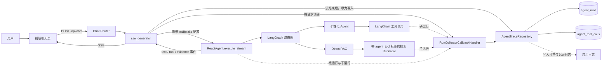
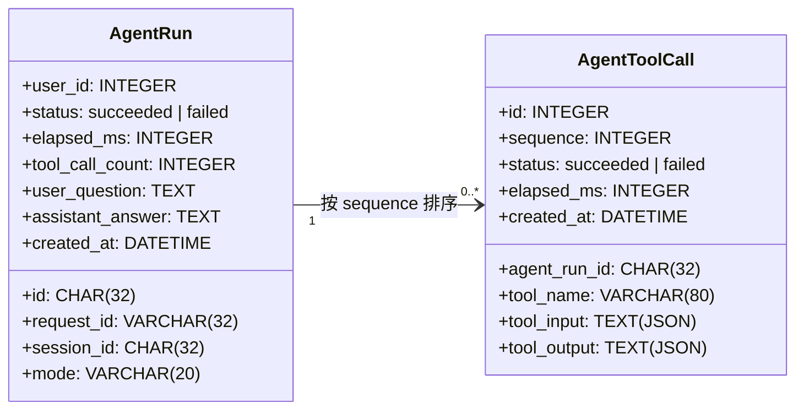
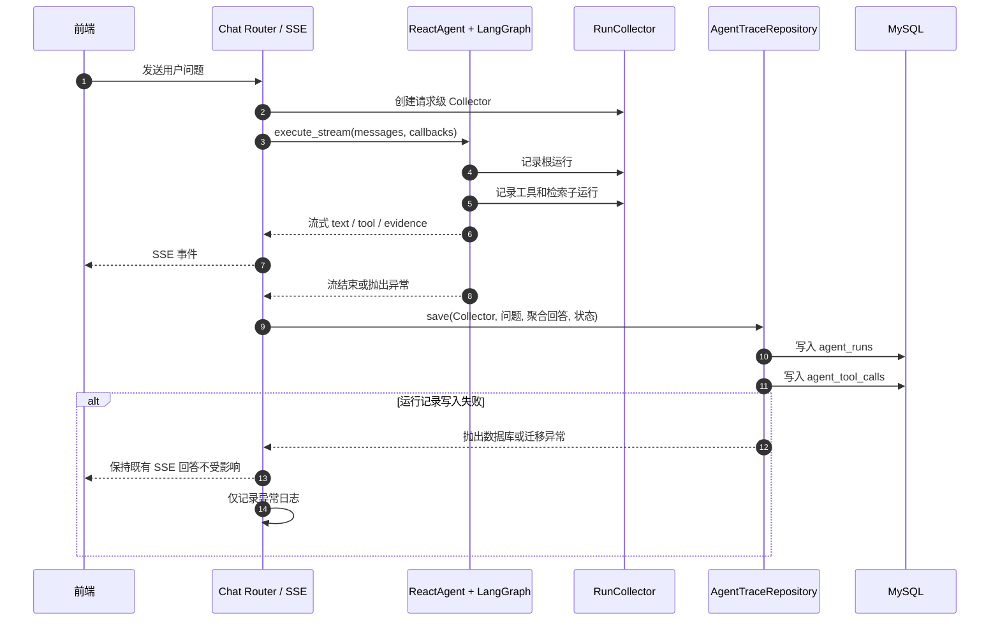
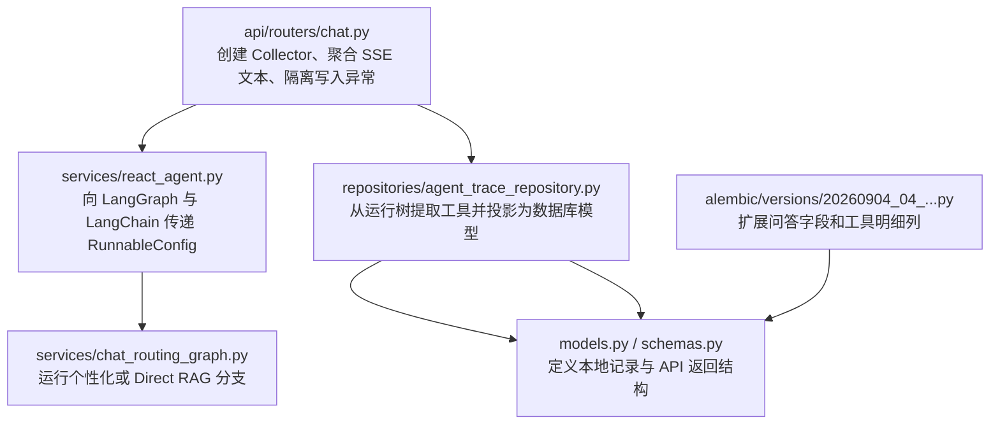

# 本地 Agent 运行记录架构

## 目标

本方案使用 LangChain 官方的 `RunCollectorCallbackHandler` 在每次聊天请求内收集运行树，随后将其投影到项目已有的 MySQL 表。它记录用户问题、最终回答及真实的工具输入输出，但不使用 LangSmith，也不增加独立的追踪服务。

核心原则：追踪属于可观测性能力，写入失败不能影响用户已收到的流式回答。

## 请求与采集数据流

`RunCollectorCallbackHandler` 是请求级对象，不跨请求复用。它接收 React Agent、工具与 Direct RAG 检索节点产生的运行事件；聊天路由只负责把 Collector 与会话元数据交给仓储层。

## 运行记录的落库结构

| 采集来源 | 写入位置 | 保存内容 |
| --- | --- | --- |
| HTTP 请求与 SSE 聚合结果 | `agent_runs` | 问题、最终回答、会话、状态、总耗时、工具次数 |
| 官方 Collector 的工具子运行 | `agent_tool_calls` | 工具名、真实输入、真实输出或异常、单次耗时 |
| 未命中根运行的兜底 | `agent_runs` | 生成 UUID，仍保存本次问答与状态 |

## 一次请求的时序与失败隔离

## 模块职责

## 配置与迁移边界

- 不配置 LangSmith，也不会将追踪数据上传到第三方云端。
- 迁移 `20260904_04` 为 `agent_runs` 增加 `user_question`、`assistant_answer`，并将工具字段升级为 `tool_input`、`tool_output` 文本列。
- 回滚到旧结构时，工具输入重置为 `{}`，工具输出截断为旧列允许的 120 字符；这是为了保证旧结构可恢复，代价是回滚会丢失详细追踪数据。
- 日志查询继续使用现有的会话与用户边界，避免新的跨用户数据访问入口。

## 阅读路径

1. 从 [`app/api/routers/chat.py`](../app/api/routers/chat.py) 查看 Collector 如何随 SSE 请求创建和持久化。
2. 从 [`app/repositories/agent_trace_repository.py`](../app/repositories/agent_trace_repository.py) 查看运行树到两张表的转换规则。
3. 从 [`alembic/versions/20260904_04_local_agent_run_logging.py`](../alembic/versions/20260904_04_local_agent_run_logging.py) 查看数据库迁移与回滚约束。
