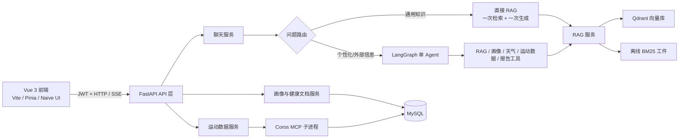
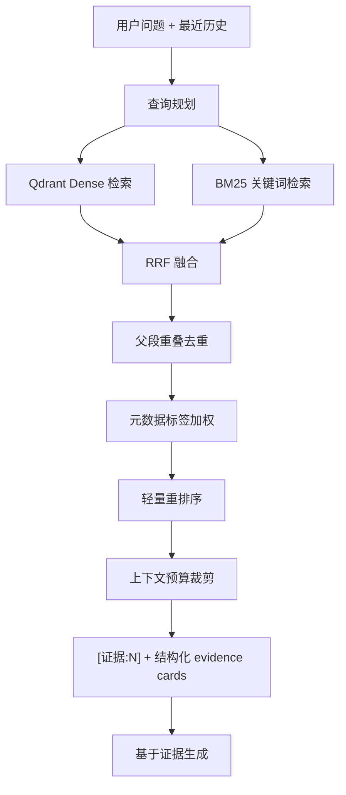

# FitAgent：AI 应用开发岗位面试准备文档

> 适用场景：用本项目应聘 AI 应用开发、RAG 工程师、LLM 应用工程师、AI 全栈开发等岗位。
>
> 使用原则：下面所有“已实现”内容都以当前代码为准；“可以继续演进”的内容不要表述为已经上线。面试中诚实说明边界，比堆砌概念更有说服力。

---

## 1. 30 秒项目介绍

**FitAgent 是一个面向健身与运动健康场景的AI教练。** 用户可以完成登录和个人画像填写，上传体检报告提取结构化健康指标，或以流式聊天方式咨询训练、动作、营养与损伤预防问题。当用户询问通用运动知识时会用RAG查询知识库；当问题涉及“我的目标、伤病、训练记录、天气或报告”时，会用LangGraph Agent 按需调用用户画像、运动数据、天气和知识检索工具，最后以 SSE 流式输出答案和可展开的证据卡片。

我在项目中重点突出三个核心产品能力，并用两个工程支撑能力把它们做成可运行闭环：

1. **可解释 RAG**：知识库离线构建、版本化发布；在线用向量检索和 BM25 混合召回，并把命中知识作为证据标注和卡片回传。
2. **用户可控记忆**：长期记忆采用“候选—用户确认—按需读取—可撤销/过期”；模型回答不能自动变成用户事实。
3. **自适应训练计划**：计划同时参考用户画像、已同步的运动摘要、执行反馈与 RAG 证据，并以确定性安全策略和结构化校验约束模型输出。
4. **工程支撑：性能与可运维性**：通用问答跳过完整 Agent 决策；Qdrant 使用 revision + alias 发布，Agent 有步数/工具预算、熔断降级和隐私友好的结构化轨迹。
5. **工程支撑：受控数据接入**：COROS 通过显式同步和本地适配器写入 MySQL，Agent 只读用户范围内的聚合摘要。

一句更口语化的表述是：**“我做的是一个把 RAG 的可追溯性、Agent 的按需工具调用、用户可控记忆、真实运动数据和安全训练计划串成闭环的运动教练应用。”**

---

## 2. 系统架构与技术栈

### 2.1 架构图



### 2.2 后端分层

后端按 `API → Service → Repository / External System` 分层，主要目录如下：

| 层级 | 代码位置 | 职责 | 面试表达 |
|---|---|---|---|
| API | `app/api/routers/` | 路由、认证、请求校验、SSE 输出 | HTTP 层不承载核心业务逻辑 |
| Schema / Model | `app/schemas.py`、`app/models.py` | Pydantic 接口契约、SQLAlchemy ORM | API 输入输出与数据库模型分离 |
| Service | `app/services/` | Agent、RAG、文档解析、业务编排 | 核心逻辑可独立测试、外部依赖有边界 |
| Repository / Adapter | `vector_repository.py`、`agent_trace_repository.py`、`coros_client.py` | Qdrant、MySQL、MCP 等外部系统适配 | 避免第三方 SDK 类型扩散到业务层 |
| Core | `app/core/` | 配置、数据库、JWT、依赖注入、请求上下文 | 基础设施与业务解耦 |

### 2.3 实际技术栈

| 范畴 | 已使用技术 | 在项目里的用途 |
|---|---|---|
| 后端 | Python 3.11、FastAPI、Uvicorn | REST API 和 SSE 流式接口 |
| 数据与认证 | MySQL、SQLAlchemy 2、Alembic、JWT、bcrypt | 用户、画像、会话、消息、Agent 轨迹持久化 |
| LLM 应用 | DashScope、LangChain、LangGraph | ChatTongyi 聊天/VL 模型、Embedding、Agent 工具编排 |
| RAG | Qdrant、DashScope Embedding、rank-bm25 | 向量检索、关键词检索、混合召回 |
| 前端 | Vue 3、Vite、Pinia、Vue Router、Naive UI | 单页应用、状态管理、界面组件 |
| 可视化/内容安全 | ECharts、marked、DOMPurify | 训练数据图表、Markdown 渲染后的 XSS 清理 |
| 多模态 | PyPDF、pdf2image、Pillow、Qwen-VL | PDF/图片体检报告的指标提取 |
| 外部设备 | MCP / `coros-mcp` | 获取 COROS 运动手表数据 |

---

## 3. Agent 采用什么范式？ReAct（不是前端 React）

这里的 **ReAct** 是 Agent 范式，拼写为 **ReAct = Reason + Act**，不是 React 前端框架。

本项目采用 **单 Agent 的 ReAct 工具调用范式**：模型先根据用户问题和系统提示决定下一步是否需要工具（Reason / 决策），调用 RAG、用户画像、天气或运动数据等工具（Act），再读取工具返回的 `ToolMessage`（Observation / 观察），继续决策，直到输出最终回答。

源码依据：`app/services/react_agent.py` 中的 `ReactAgent` 使用 LangChain `create_agent(...)` 创建 Agent，LangGraph 负责工具调用循环；`app/services/middleware.py` 通过 `@wrap_tool_call` 在每次工具调用前后注入上下文、预算、审计与错误降级。

### 3.1 面试可以这样回答

> “我的 Agent 采用 ReAct 范式：LLM 不直接把所有能力写死在 prompt 里，而是根据当前问题决定是否调用工具。比如用户问通用动作知识时，系统直接走 RAG；问‘结合我的膝盖伤和目标今天怎么练’时，Agent 会按需读取用户画像和 RAG 资料，再综合生成建议。工具结果会作为观察结果回到 Agent 状态中，支持下一步决策或最终回复。”

> “它是一个受控的单 Agent，不是为了概念堆砌而使用多 Agent。项目设置了最大递归步数和每请求的工具预算，并对外部工具配置有限重试、熔断和降级，避免 Agent 陷入工具循环。”

### 3.2 ReAct 在本项目中的实际流程

```text
用户问题
  → 判断是否为明确通用知识问题
  ├─ 是：直接 RAG（检索 → 一次模型生成），跳过首次 Agent 工具决策
  └─ 否：进入 LangGraph ReAct Agent
        → LLM 决定调用哪个工具
        → middleware 检查工具预算并注入 user_id / 城市 / 检索历史
        → 执行工具（RAG、画像、天气、运动数据等）
        → ToolMessage 返回给 Agent
        → LLM 继续调用工具或生成最终流式答案
```

这个“直接 RAG + ReAct Agent”的双路径是一个刻意的取舍：**不需要规划的问题就不让 Agent 额外规划；需要个性化或外部信息的问题才使用 Agent 的工具编排能力。**

### 3.3 使用的 Agent 框架

- **LangChain**：模型、Tool 和 `create_agent` 的抽象层。
- **LangGraph**：执行 Agent 的状态图和工具调用循环；本项目用其 `stream_mode="messages"` 将模型分片和工具消息转为 SSE。
- **FastAPI**：不是 Agent 框架，而是承载 HTTP API 和 SSE 的后端框架。

### 3.4 前端采用的范式和框架（补充）

前端实际使用的是 **Vue 3**，不是 React。Vue 3 的组合式 API 与 `<script setup>` 用于页面逻辑；构建用 Vite，路由用 Vue Router，状态管理用 Pinia，UI 组件用 Naive UI。

证据：入口文件 `frontend/src/main.js` 通过 `createApp(App)`、`createPinia()` 和 `router` 初始化应用；聊天页 `frontend/src/views/Chat.vue` 使用 `ref`、`computed`、`watch`、`onMounted` 等 Composition API。

### 3.5 前端采用的编程范式

1. **组件化与声明式 UI**：页面拆为 `views/`、`components/`，模板根据响应式状态自动更新，而不是手动操作 DOM。
2. **组合式 API**：相关状态和函数按功能聚合，例如聊天页把流式状态、SSE 解析、证据卡片展开、健康文档上传放在同一组件逻辑中；相比 Options API 更利于复用组合函数。
3. **单向数据流**：组件通过 action 调用 Pinia store，再由 store 保存会话/消息状态；并非直接把数据库字段绑定到页面。
4. **前后端分离**：前端只消费 API contract。聊天接口使用 `fetch` 读取 `ReadableStream`，按 `data: ...\n\n` 解析 SSE 的 `text`、`tool`、`evidence`、`error` 事件。

可这样回答“为什么不用 React”：

> “这是一个 Vue 技术栈项目，选 Vue 3 是因为组合式 API 与中文后台/业务应用开发效率较高，Naive UI 也能快速提供统一组件。框架本身不是项目亮点；我更关注前后端 API 边界、流式状态管理和 AI 功能的可解释性。如果岗位要求 React，我能把同一套状态和 SSE 处理逻辑映射为 React Hooks、Context/Zustand 和组件树，核心设计不依赖某个 UI 框架。”

### 3.6 后端与 AI 框架

- **FastAPI**：Python Web 框架。Pydantic 自动校验请求/响应，依赖注入取得数据库会话和当前用户；`POST /api/chat` 返回 `StreamingResponse`。
- **LangChain**：对聊天模型、Embedding 和 Tool 做适配，避免业务层直接耦合厂商 SDK。
- **LangGraph**：承载单 Agent 的状态图与工具调用循环。项目调用 `create_agent(...)` 创建 ReAct 风格 Agent，并通过 middleware 注入工具监控和动态提示词。
- **不是“自研大模型”**：生成模型、Embedding 和视觉模型由 DashScope 提供；项目的价值在编排、检索、数据边界和工程可靠性。

---

## 4. RAG 检索实现（重点）

### 4.1 为什么需要 RAG

健身动作、营养和损伤预防知识不适合完全依赖模型参数记忆：回答可能过时、无法说明信息来源，也难以限制到经过审核的材料。RAG 的思路是：**先从受控知识库召回证据，再把证据与问题一起交给模型生成答案。**

本项目的目标不是“检索到一段文本”而已，而是得到可追溯、可升级、可降级的检索结果。

### 4.2 离线索引：知识从文件到可发布的索引

入口为 `python -m app.services.knowledge_indexer`，主要在 `app/services/knowledge_indexer.py`。

```text
data/ 审核后的 TXT / Markdown / PDF
  → 清洗与标准化
  → Markdown 标题感知切分
  → parent chunk（上下文段）与 child chunk（检索段）
  → 内容去重、标签增强、source/chunk 元数据
  → Embedding
  → 新建 Qdrant revision collection
  → 写入同 revision 的 BM25 文档工件
  → 校验通过后，将 rag_active alias 指向新 revision
```

关键设计及其价值：

| 设计 | 当前实现 | 为什么这样做 |
|---|---|---|
| 离线/在线分离 | 索引构建显式运行；在线 API 只读 | 避免用户请求触发全量导入、重建或污染索引 |
| 标题感知切分 | `MarkdownHeaderTextSplitter` + 递归切分器 | 降低切片割裂章节语义的概率 |
| 父子切片 | child 用于精准召回，parent 用于给模型提供上下文 | 兼顾命中精度和可读上下文 |
| 元数据 | `source_id`、`chunk_id`、`parent_id`、标签、revision 等 | 支持来源过滤、去重、证据展示、审计 |
| 内容去重 | 构建时清洗与近重复控制 | 减少同一知识多次占据 Top-K |
| revision 发布 | 新 collection 构建完成后才切换 `rag_active` | 发布失败不影响线上旧索引，支持回滚 |
| BM25 工件同版本 | 离线输出 `bm25_documents.json` | 防止稠密/稀疏检索来自不同资料版本 |
| 预检 | `knowledge_preflight` 输出来源、chunk、唯一 ID 等检查报告 | 阻止空写、意外缩小数据集等低级事故 |

可用于面试的发布说明：

> “我没有把 collection 固定覆盖。每次构建生成一个带 revision 的 collection，验证成功后再原子地切换 `rag_active` alias；线上始终读 alias。这样新索引有问题时，旧版本仍可服务，回滚也是切 alias，而不是重新灌库。”

### 4.3 在线检索：从问题到证据

在线实现由 `app/services/rag_service.py` 编排，主要流程如下。



#### A. 查询规划（Query Planning）

`QueryPlanner` 并不是每轮都调用模型。它只针对两类问题触发：

- 指代、省略：例如“那深蹲呢？”需要结合最近对话改写成完整查询；
- 复合问题：例如“新手减脂怎么练和怎么吃？”拆为最多两个独立子查询。

它最多取最近 3 轮历史，最多产生 2 个子查询；JSON 无效、模型超时或调用失败时回退为原问题单查询。这样避免“为检索再检索”的无限链路和额外时延。

#### B. Dense 检索 + BM25 检索

1. **Dense（语义检索）**：问题经 `text-embedding-v1` 向量化后，在 Qdrant 的 active revision 搜索。它擅长“表达不同但含义相似”的问题。
2. **BM25（关键词检索）**：使用 `rank-bm25` 在离线文档工件上检索。中文采用字级 token，英文和数字保留整体，例如“深蹲”拆为“深”“蹲”，`BMI` 仍作为整体。它对专业词、动作名、数字指标的精确命中更稳定。
3. **并发执行**：对于每个子查询，Dense 与 BM25 由线程池并行执行；结果聚合保持查询计划顺序，以保持同请求下的排序确定性。

这就是混合检索的面试回答：

> “向量检索解决同义表达和语义召回，BM25 保留关键词精确性；两者不是谁替代谁，而是互补。比如用户把深蹲描述成下肢复合动作时，Dense 更有优势；问某个动作名或 BMI 数值时，BM25 往往更稳。”

#### C. RRF 融合、去重与重排序

项目没有直接混合不同检索器的原始分数，因为 cosine 相似度和 BM25 分数不在同一量纲。采用 **Reciprocal Rank Fusion（RRF）**：

\[
score(d) = \sum_i \frac{1}{k + rank_i(d)}, \quad k=60
\]

- `rank_i(d)` 是文档在第 i 路检索中的名次；名次越高，加分越多。
- RRF 只依赖名次，因此避免不同分数尺度难比较的问题。
- 融合后按 chunk ID 汇总，并做父段重叠去重。

之后还有两个轻量调优：

- **标签加权**：查询标签与 chunk 标签重合时可提升分数（配置权重 0.15）；标签不存在时保留原排序。
- **LexicalReranker**：在有限候选（默认前 12）中，以 70% RRF 分数 + 30% 查询词覆盖率重排。它是确定性、无额外模型依赖的 V1 实现，已明确保留替换成 Cross-Encoder 或云端 rerank API 的接口边界。

外部知识图谱三元组的来源前缀 `external/fitkg-cn/` 会有 8% 的**软惩罚**。这不删除资料、不影响召回，只降低低信息密度三元组在分数接近时抢占 Top-1 的概率。这是“用评测/观察驱动小幅调优”而不是硬编码过滤。

#### D. 降级与一致性保护

- 在线请求读取 Qdrant 当前 `rag_active` 的 revision。
- 仅当 BM25 工件 revision 与 Qdrant active revision 一致时才进行混合检索；不一致或工件缺失时，记录告警并退化成 Dense 检索。
- Dense 失败会返回“知识库暂时不可用”；BM25 失败不阻断主路径。
- 重排序可以通过配置关闭，关闭后保持 RRF 顺序。

这部分说明项目考虑到了“索引更新期间两条检索链路数据不一致”的真实问题。

### 4.4 上下文构造与可解释引用

检索到 Top-K（默认 6）并不意味着把所有全文塞进 prompt。`ContextBuilder` 有硬预算：总上下文最多 6000 字符，单条证据最多 1200 字符；父段过长时优先保留命中的 child 文本附近内容。

最终给模型的内容包含稳定编号：

```text
[证据:1] 来源=动作指南大全.txt | 证据ID=动作指南大全.txt#chunk-x
……与问题最相关的父段文本……

证据目录：
[证据:1] 动作指南大全.txt#chunk-x | 来源=动作指南大全.txt
```

系统提示要求：**只有采用某条资料的结论才保留相应 `[证据:N]`，不得凭空编造编号。** 同时，后端直接将真实命中构造成 `evidence` SSE 事件，前端以可展开卡片显示来源、片段、标签、rank、score；它不是从模型最终文本“猜测”引用。

### 4.5 RAG 如何评估与验证

项目包含 `app/evaluation/retrieval_cases.json` 和 `retrieval_evaluator.py`，可输出当前 revision 的 Recall@6、来源正确率和证据支持率。常用验证命令：

```powershell
.\.venv\Scripts\python.exe -m app.services.knowledge_preflight
.\.venv\Scripts\python.exe -m app.services.knowledge_indexer
.\.venv\Scripts\python.exe -m app.evaluation.retrieval_evaluator
```

答辩时要强调：这些指标主要覆盖**检索层**，不能直接证明最终生成质量。若进一步演进，应分别评估召回、排序、引用正确性、答案忠实度（faithfulness）和人工安全审查结果。

---

## 5. Agent 的实现与“ReAct”说明

### 5.1 Agent 在这里做什么

Agent 不是每个问题都必须走的“聊天外壳”。本项目把它用于真正需要多源信息、工具选择和步骤编排的请求，例如：

- “结合我的目标和膝盖不适，今天怎么练？”：读取用户画像 + RAG；
- “我所在城市今天适合户外跑吗？”：位置 + 天气；
- “结合最近的训练记录给我建议”：运动数据 + 画像 + RAG；
- “生成本月训练报告”：根据运行上下文切换报告提示词和相关工具。

`ReactAgent` 调用 LangChain 的 `create_agent`，由 LangGraph 运行。可调用的工具包括：`rag_summarize`、`get_user_profile`、`get_fitness_summary`、`get_weather`、`get_user_location`、`get_user_id`、`get_current_month` 和 `trigger_report`。

### 5.2 ReAct 是什么，项目如何用

ReAct 可以理解为“**推理/决策（Reason）— 执行动作（Act）—读取观察结果（Observation）—继续决策**”的 Agent 模式。这里模型可根据问题选择工具，工具结果以 `ToolMessage` 回到状态中，然后模型继续生成或调用下一工具。

面试中不要声称“展示了完整思维链”。当前前端显示的是**工具调用进度**，如“获取用户画像”“检索知识库”，不是暴露模型内部推理文本。这是更合适的产品与安全设计。

### 5.3 为什么有“直接 RAG 快速路径”

`ReactAgent._should_use_direct_rag()` 通过知识关键词和个性化关键词做保守路由：

- 非个性化的动作、训练、营养、损伤预防问题：`RAG → 一次答案模型调用`；
- 含“我的、结合我、训练记录、体检、天气”等个性化信号：进入完整 Agent。

好处是普通知识问答少一次 Agent 工具决策，降低延迟和 token 成本；同时不让“结合我的伤病”的请求误跳过画像读取。它是规则路由，优点是可解释、低成本；局限是靠关键词会有误判，后续可以在积累标注数据后换成轻量 intent classifier 或模型路由，并比较质量/延迟收益。

### 5.4 Agent 可靠性与可观测性

| 风险 | 当前控制方式 |
|---|---|
| 工具循环或无限执行 | `AGENT_MAX_STEPS` 默认 8，LangGraph `recursion_limit`；每请求 `AGENT_MAX_TOOL_CALLS` 默认 6 |
| 外部网络瞬时失败 | 工具层仅对网络类异常有限重试（默认 1 次） |
| 连续失败拖垮服务 | 每个工具独立 Circuit Breaker：closed → open → half_open → closed |
| 工具出错后反复调用 | middleware 返回可读 ToolMessage，要求模型基于已有信息继续回答 |
| 用户看不到过程 | SSE 发送 `tool`、`evidence`、`text`、`error` 四类事件 |
| 难以排查慢请求 | AgentRun/AgentToolCall 保存 mode、状态、耗时、工具顺序和参数类型 |
| 审计泄露隐私 | 轨迹不存用户原文、工具参数值和模型回复原文，只存 argument shape |

`ContextVar` 用于把当前用户、城市、检索历史带入工具调用上下文。middleware 设置它后一定在 `finally` 中 reset，避免并发请求之间串用户上下文；LangGraph runtime context 也保存本轮工具计数和事实。这是一个可以强调的并发隔离细节。

---

## 6. Agent 记忆管理（重点，务必如实回答）

### 6.1 先给结论

项目实现的是**近期会话原文 + 可重建的确定性会话暂存状态 + 用户确认的长期记忆**，并与用户主动维护的结构化画像分开。它不是把所有聊天记录无限塞给模型，也没有把聊天全文向量化为长期记忆；会话暂存状态只从较早的用户消息按规则提取，不依赖 LLM 自由总结。

可以这样回答：

> “我把模型上下文、会话暂存状态、用户长期记忆和用户画像分成四种不同的数据。模型只看到最近 10 轮（20 条）原文；更早用户表达通过确定性规则形成带来源含义的短期状态。跨会话事实先进入 proposed 候选，必须由用户确认才成为 Agent 可读取的 confirmed 记忆。这样既控制 token，也防止模型把猜测写成健康偏好或伤病事实。”

### 6.2 三层记忆的实现

| 层次 | 数据 | 存放位置 | 读取/写入方式 | 用途与边界 |
|---|---|---|---|---|
| 近期上下文 | 用户与助手消息 | `messages` 表 | 每条消息持久化；聊天时只传最近 10 轮（20 条） | 保持当前对话连贯性，并控制 token 成本 |
| 检索短历史 | 最近对话 | 运行时 `retrieval_history` | 从当前会话末尾取最近 6 条消息 | 供 QueryPlanner 处理“那个动作”等指代；规划器最终只用最近 3 轮 |
| 会话暂存状态 | 城市、训练目标、伤病、饮食偏好等 | `session_summaries` 表 | 仅由窗口外的 user 消息经 `extract_session_facts()` 确定性提取，可重建 | 作为有来源说明的短期上下文；不是长期记忆，也不自动写画像 |
| 长期记忆 | 可跨会话复用的个人事实 | `memory_facts` 表 | 聊天只生成 `proposed`；用户确认后才是 `confirmed`，支持撤销、替换与过期 | Agent 只读 confirmed、未过期的最多 6 条 |
| 结构化画像 | 年龄、身高体重、训练频率、健康指标等 | `user_profiles` 表 | 用户通过 Profile API 或确认健康文档结果维护 | 业务字段稳定、可展示、可修改；与对话记忆分开 |
| 执行轨迹（不是业务记忆） | 工具名、参数类型、耗时、状态 | `agent_runs` / `agent_tool_calls` | 每轮聊天结束后独立事务落库 | 供运维审计，不能作为模型记忆；不存原文 |

### 6.3 关键流程

```text
用户发起聊天
  → 保存 user message 到 MySQL
  → 只从本条 user message 生成 proposed 记忆候选
  → 读取当前 session 的全部审计消息
  → 由较早 user 消息刷新可重建的 session_summary
  → 截取最近 10 轮（20 条）原文作为模型上下文
  → Agent runtime context 注入 user_id、城市、会话暂存状态与检索短历史
  → 个性化问题需要时调用 get_user_profile / get_confirmed_memories / get_fitness_summary
  → 流式回复结束后保存 assistant message
```

### 6.4 为什么不把“记忆”等同于聊天记录

原始聊天记录是高噪声、易过期、包含敏感信息的非结构化数据。用户说过“我想减脂”不一定表示永久目标；用户临时提到膝盖不舒服也不应自动成为永久医学标签。因此项目采用：

- 画像由用户主动填写/确认后写入；
- 体检报告识别结果先返回页面，用户处理冲突并确认后才更新画像；
- 较早的会话状态只从 user 消息确定性提取，可从审计原文重建；
- 聊天产生的长期事实停留在 `proposed`，只有用户确认后才会被 Agent 读取；
- assistant/tool 内容不会参与事实提取，阻断“模型自说自话后反向写入记忆”；
- 会话历史有固定窗口，控制 token、延迟与陈旧上下文。

这是数据最小化和用户可控性的体现，尤其适合健康相关应用。

### 6.5 当前局限与可演进方案

应主动说出局限，并给出可验证的改进路径：

1. **确定性会话状态覆盖面有限**：当前只提取少量可识别事实，无法承载复杂长任务的完整进展。应先建立会话评测，再决定是否引入带来源 message ID、可编辑的 schema-bound 摘要。
2. **跨会话偏好不够丰富**：可让受 Pydantic schema 约束的 LLM 提取器补充 `proposed` 候选，但不得绕过用户确认、来源、更新时间和撤销能力。
3. **向量记忆不是默认答案**：若确实有“回忆过去训练反馈”的需求，可建立 user-scoped memory collection，按 `user_id` 强制过滤，并设置 TTL、删除能力、敏感字段禁止入库和离线评测。
4. **确认交互仍可演进**：可增加候选合并、冲突解释和确认原因展示，但不改变“用户拥有长期事实写权限”的边界。

---

## 7. 可补充展示的项目能力

### 7.1 多模态健康文档解析

这是 AI 应用岗位中很有辨识度的一块：

1. 用户上传 JPG/PNG/WebP/PDF，服务端先用 MIME 检测与大小限制（10 MB）校验。
2. 可选文本 PDF：文字达到阈值时，由聊天模型抽取；扫描件 PDF：逐页渲染成图片，交给 Qwen-VL Plus；失败时 Qwen-VL Max 兜底。
3. 模型输出必须通过 Pydantic `HealthDataSchema` 校验，只接受十类健身相关指标。
4. 多页同一指标不一致时，后端返回冲突候选与页码；**用户在前端选择确认后**，再通过 Profile API 写入画像。
5. 临时文件在 `finally` 中清理；加密 PDF、页数和文本长度都有保护。

面试表述：

> “多模态模型只负责提取，不做诊断。模型输出不是可信数据，必须过 schema 校验；冲突不由模型或后端猜测，而是交给用户确认。这把 AI 的不确定性放在可控的人机协作流程里。”

### 7.2 MCP 与运动数据集成

FitAgent 通过 `CorosClient` 把 `coros-mcp` 当作独立子进程，而非把 SDK 逻辑散落在业务代码中。这里采用 MCP 的**现实前提**是：COROS 虽有官方 API 申请通道，但访问并不是任意个人开发者可立即、自由调用的公共接口；官方说明会逐个审核申请，且不能向所有申请方提供访问权限。[COROS API 申请说明](https://support.coros.com/hc/en-us/articles/17085887816340-Submitting-an-API-Application)

因此，当前项目不是直接用自己申请到的 COROS OAuth `client_id/client_secret` 调官方 API；而是使用社区 `cygnusb/coros-mcp` 的本地适配器。认证令牌由其 CLI 写入操作系统安全存储，FitAgent 只启动已认证的 stdio 子进程并强制 `readonly`、隐藏认证工具。MCP 在这里首先是**受限官方接入条件下的适配层**，其次才带来协议统一和边界隔离的工程收益。

具体实现为：

- stdio 上运行 JSON-RPC 2.0；启动后完成 `initialize` 与 `notifications/initialized` 握手；
- 暴露 `get_daily_metrics`、`get_sleep_data`、`list_activities` 三个业务方法；
- 对子进程存活和 30 秒超时做检查；
- 社区 MCP 固定提交并按部署约定安装在 Git 忽略的 `.tools/coros-mcp-venv`，避免 FastMCP 传递依赖污染 FastAPI 服务；
- 运动数据服务与对话 Agent 是两个子系统，只通过数据库层共享数据，没有直接耦合。

需要如实说明：当前 Agent 工具中有 `get_fitness_summary` 读取已落库的 `fitness_data`；Coros 同步本身走 `/api/fitness/*` 侧，架构文档明确没有让 Agent 直接操作 Coros MCP。这是有意识的 ETL/推理解耦。

### 7.3 API 契约、认证和安全

- Pydantic schema 定义 chat、profile、健康数据等接口输入输出，防止把 ORM 结构直接暴露给前端。
- JWT Bearer Token 鉴权；bcrypt 存密码哈希，不存明文。
- Chat 接口按登录用户 ID 限流，未能解码 token 时才回退 IP。
- 输入防护：聊天消息非空且最大 4000 字符；上传限制 MIME、大小、页数和文本量。
- 输出防护：流式回答会用正则脱敏手机号、身份证号、邮箱；Markdown 使用 DOMPurify 清理。
- 健康文档处理告知用户会发送到模型；模型抽取结果必须经确认写入。

### 7.4 前端流式体验

`Chat.vue` 不使用浏览器原生 `EventSource`，因为后端聊天接口是 POST 且需要携带 Authorization header；因此使用 `fetch` 获取响应体的 `ReadableStream`，用 `TextDecoder` 和缓冲区拆分 SSE 帧。前端分别处理：

- `tool`：展示当前正在调用的工具；
- `evidence`：保存真实检索证据，渲染来源卡片；
- `text`：增量拼接助手回复；
- `error`：停止加载并显示用户可理解的错误。

这说明你理解“流式生成不仅是后端 `yield`，还包括前端分帧、状态机、异常收敛和最终消息落盘”。

### 7.5 工程质量

- 配置通过 `.env` / Pydantic Settings 注入，模型、向量库、RAG 参数均外置 YAML 或环境变量；敏感 `.env` 不提交。
- 数据库使用 Alembic 迁移；Agent trace 有独立事务，写轨迹失败不影响用户已拿到的回复。
- `.gitignore` 忽略数据、日志、模型、上传与索引生成物。
- 已有单元测试覆盖 RAG、检索路由、BM25、文档解析、会话事实、Agent 上下文、工具预算、轨迹、API 契约、认证等；质量命令为：

```powershell
.\.venv\Scripts\python.exe -m ruff format --check app
.\.venv\Scripts\python.exe -m ruff check app
.\.venv\Scripts\python.exe -m pytest app/tests
npm --prefix frontend run build
```

---

## 8. 高频面试问答（可直接练习）

### Q1：你的 RAG 为什么不直接只用向量库？

**答：** 纯向量检索擅长语义相近的表达，但对动作名称、营养元素、数值指标等精确关键词不一定稳定。项目用 Dense 和 BM25 双路召回，再用 RRF 按排名融合，避免直接拼接不同量纲的分数。离线同步构建 BM25 工件，并检查它和 Qdrant 的 revision 一致性；不一致时宁可降级 Dense，也不混用不同版本知识。

### Q2：RAG 如何避免幻觉？

**答：** 不能承诺完全消除幻觉，但做了四层约束：受控审核知识源；生成 prompt 要求只根据证据作答；稳定 `[证据:N]` 绑定真实检索 hit；前端展示来源卡片而不是伪造引用。健康场景还明确不做诊断。后续应以证据支持率、人工评审和拒答策略进一步验证，而不是只看模型回答是否“流畅”。

### Q3：为什么通用问题不全都走 Agent？

**答：** Agent 每多一轮工具决策，就增加延迟、token 成本和不确定性。明确的通用知识问题只需要 RAG 证据，因此走“一次检索 + 一次生成”；涉及个人画像、训练数据、天气等多源信息时才进入 Agent。路由规则保守，避免个性化请求跳过关键数据。

### Q4：你的 Agent 如何防止无限调用工具？

**答：** 两道限制：LangGraph 的 `recursion_limit` 约束最大步骤数，middleware 维护请求级工具计数并限制最大工具调用数。超限时返回 ToolMessage，要求模型基于已有信息收敛回答。外部服务还有有限重试、独立熔断和降级。

### Q5：你的 Agent 记忆是什么？如何避免模型把错误信息记住？

**答：** 我没有把聊天全文或向量检索直接叫“记忆”，而是做了三层：最近 10 轮（20 条）原文、由较早**用户消息**确定性提取且可重建的会话暂存状态、以及 `memory_facts` 长期记忆。聊天只能产生 `proposed` 候选，用户在页面确认后才会成为 `confirmed`；Agent 用只读工具按需读取，撤销和过期项会过滤。提取器明确忽略 assistant/tool 消息，所以模型不能通过一句“你在上海、有膝伤”把幻觉反向写进系统。用户改口时新候选记录 `supersedes_id`，确认后撤销旧值。

### Q6：为什么训练计划不能只靠 Prompt 约束？

**答：** Prompt 只能影响概率，不能作为安全门禁。计划服务先把画像、近四周 Coros 聚合和执行反馈交给确定性 `TrainingSafetyPolicy`，算出允许的最高强度；然后才让模型生成 Pydantic `WeeklyTrainingPlan` JSON。服务层会验证 7 天覆盖、训练天数不超过用户设定、动作强度不越界、引用证据 ID 真实存在；任一失败就不写库。这让“模型生成”与“业务允许执行”分离，也更容易单测和审计。

### Q7：为什么用 Qdrant revision + alias？

**答：** 索引构建不是瞬时操作，直接覆盖线上 collection 会让用户读到半成品或失败版本。新 revision 完整写入并验证后，才把 `rag_active` alias 切过去；线上读 alias，因此旧版本可持续服务且可快速回滚。

### Q8：你如何处理 RAG 的上下文太长？

**答：** 不是把 Top-K 原文全塞进 prompt。系统用 child chunk 召回、parent chunk 提供语境；再给总 6000 字符和单证据 1200 字符硬预算，优先截取命中子段附近。这样兼顾证据完整性、成本和模型注意力。

### Q9：健康报告的模型结果能直接入库吗？

**答：** 不能。模型输出先过 Pydantic schema，限定字段、类型和单位；多页冲突返回候选与页码给用户选择，用户确认后才写画像。模型只做提取，不做医学诊断。

### Q10：Coros MCP 为什么要做串行和超时重建？

**答：** MCP 的 stdio 是单条 stdin/stdout 流，若两个 HTTP 请求同时发送 JSON-RPC，回包可能交叉，不能靠请求 id 补救所有协议污染。我对完整请求—响应持有锁；Windows pipe 不能用 `select.select`，所以 reader thread 加 queue timeout。超时后不复用这条不可信流，而是终止进程，下一次懒重启。数据落库也不再按日期唯一，活动按外部 `activity_id` 幂等，因此同一天晨跑和夜跑不会覆盖。

### Q11：如果让我把 Vue 换成 React，你怎么做？

**答：** 后端 API 和 SSE event contract 不变。前端将 Vue 的 `ref/computed` 映射为 `useState/useMemo`，Pinia 映射为 Zustand/Redux Toolkit 或 Context，Vue Router 映射为 React Router；关键是保留聊天流的状态机、取消/异常处理、证据卡片以及 profile 与 UI 模型的边界。

### Q12：项目还有哪些不足？

**答：** 当前快速路由为关键词规则，尚无真实线上数据支撑的分类器；重排序是轻量 lexical rerank，尚未比较 Cross-Encoder 的收益；会话摘要是确定性事实摘要，尚未引入经评测的 schema-bound LLM 摘要；评测覆盖检索和关键安全拒绝，生成忠实度、计划人工偏好，以及 Coros 的端到端 MySQL 幂等仍需持续评测；Qdrant 还是单节点演示部署。我的优先级是先补评测和观测，再基于瓶颈演进，避免无依据地堆叠多 Agent 或复杂基础设施。

---

## 9. 建议的 5–7 分钟演示脚本

1. **0:00–0:40，定位与架构**：介绍“证据化 RAG + 按需 Agent + 画像与多模态文档”的闭环，并展示架构图。
2. **0:40–2:00，通用问答**：提问“深蹲时膝盖应该朝哪里？”。说明它走 direct RAG，Dense+BM25+RRF，答案后有 `[证据:N]`。
3. **2:00–2:35，解释证据**：展开前端来源卡片，说明卡片来自检索结构化事件，不是从 LLM 文本反推。
4. **2:35–3:25，记忆控制**：发送包含城市/目标/不适的消息，切到“我的记忆”页，展示候选、确认和撤销；强调 assistant 输出无法写入记忆。
5. **3:25–4:35，训练计划**：同步数据后在“本周计划”生成计划，展示安全上限、RAG 证据 ID、按天反馈；解释服务端为什么会拒绝越界 JSON。
6. **4:35–5:20，工程保障**：展示 Qdrant `rag_active`、预检/评测报告或 `agent-runs`；说明 Coros stdio 串行、超时重建和活动 external ID 幂等。
7. **5:20–5:50，多模态补充**：演示上传报告后的“抽取—冲突—用户确认”流程，说明 schema 校验和非诊断边界。
8. **5:50–6:30，主动说取舍**：说出当前没有多 Agent、自动下发设备训练、Cross-Encoder 的原因和下一步评测计划。

---

## 10. 源码导览（面试前重点看）

| 要讲的主题 | 优先阅读的文件 |
|---|---|
| 应用入口、CORS、生命周期 | `app/main.py` |
| 聊天 API、SSE、会话窗口 | `app/api/routers/chat.py` |
| Agent、直接 RAG 路由 | `app/services/react_agent.py` |
| 工具、天气、画像、运动数据 | `app/services/agent_tools.py` |
| 工具预算、ContextVar、动态 prompt | `app/services/middleware.py` |
| RAG 编排、RRF、降级、上下文 | `app/services/rag_service.py` |
| BM25 | `app/services/bm25_retriever.py` |
| Rerank 接口 | `app/services/reranker.py` |
| 离线索引与 revision 发布 | `app/services/knowledge_indexer.py` |
| 会话事实 / 记忆 | `app/services/session_facts.py`、`app/services/memory_service.py`、`app/api/routers/memory.py` |
| 自适应训练计划 | `app/services/fitness_insights.py`、`app/services/training_plan_service.py`、`app/api/routers/training_plans.py` |
| 轨迹审计 | `app/services/agent_trace.py`、`app/repositories/agent_trace_repository.py` |
| 健康报告解析 | `app/services/doc_parser.py` |
| MCP 适配 | `app/services/coros_client.py` |
| 前端流式聊天 | `frontend/src/views/Chat.vue`、`frontend/src/stores/chat.js` |
| 配置与检索参数 | `config/vector_store.yml`、`config/models.yml` |
| 现有演示与设计依据 | `docs/interview-demo.md`、`docs/refactoring/02-rag-offline-pipeline.md`、`docs/refactoring/03-rag-online-pipeline.md`、`docs/refactoring/04-llm-agent-conversation.md` |

---

## 11. 面试前最后检查清单

- 能用自己的话解释：为什么本项目是 Vue 3 而不是 React。
- 能画出“离线索引”和“在线检索”两条流程，并说明两者为何分离。
- 记住 RRF 解决的是“不同检索分数尺度不可直接比较”。
- 能区分：会话消息、会话暂存状态、候选/已确认长期记忆、用户画像、执行轨迹分别是不是记忆、是否持久化。
- 不夸大“思维链”“多 Agent”“自动下发 Coros 训练”“医学诊断”等未实现或不应暴露能力。
- 遇到不会的问题，回到工程取舍：边界、失败模式、可观测性、评测方法和下一步验证计划。
