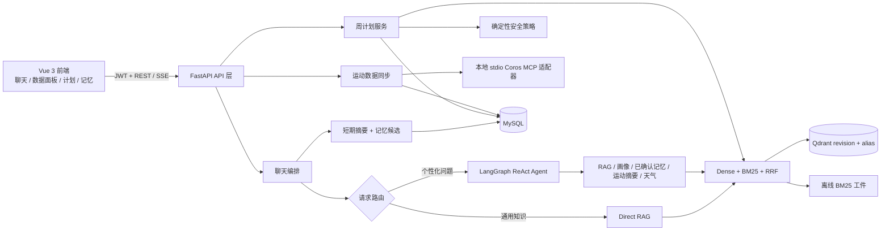

# FitAgent 架构说明

> 定位：**可解释 RAG + 用户可控记忆 + 自适应训练计划**的私人健身 Agent。
>
> 本文以当前代码为准。产品边界是运动建议，不做医学诊断；训练计划和健康数据均保留用户确认与安全降级机制。

## 1. 系统总览



后端遵循 `API → Service → Repository / External System`：路由只处理鉴权、HTTP 契约与事务边界；服务层编排业务；`coros_client.py`、`vector_repository.py` 等隔离第三方协议与 SDK 类型。

## 2. 对话、RAG 与记忆

### 2.1 路由与检索

- 明确、非个性化的健身知识问题走 Direct RAG：一次混合检索、一次生成，降低 Agent 决策延迟和工具不确定性。
- 需要画像、运动数据、天气或跨会话偏好的问题进入 LangGraph ReAct Agent；中间件施加递归步数和工具调用预算，写入不含原文的执行轨迹。
- RAG 使用 Qdrant Dense 检索与 BM25 双路召回、RRF 融合、去重与轻量重排。离线索引先构建 revision、校验后切换 `rag_active` alias；线上只读。

### 2.2 三层记忆模型

| 层 | 载体 | 写入规则 | Agent 可见性 |
|---|---|---|---|
| 近期上下文 | 最近 10 轮（20 条）`messages` | 原始聊天记录 | 当前会话直接可见 |
| 会话暂存状态 | `session_summaries` | 仅由较早的**用户**消息做确定性提取，可重建 | 作为有来源标记的短期上下文 |
| 长期记忆 | `memory_facts` | 聊天只创建 `proposed` 候选；用户在“我的记忆”确认后才变为 `confirmed` | 通过只读工具按需读取，最多 6 条、自动过滤过期/撤销项 |

关键安全约束：`extract_session_facts` 忽略 assistant 和 tool 内容，因此模型不能借回答把虚构事实反向写入记忆。新候选替换已确认值时记录 `supersedes_id`；确认新值会撤销旧值。用户可以随时撤销，候选与撤销项永不作为长期事实提供给 Agent。

### 2.3 健康文档：提取与确认分离

健康文档不是诊断功能，也不会在上传后自动写入用户画像。前端只把用户选择的文件交给识别接口；服务端返回可编辑的指标和冲突项，用户确认后才更新 `health_data`。


`Chat.vue` 的 `confirmHealthData` 仅在冲突已处理时调用 `updateProfile`；取消、关闭或识别失败都不会持久化指标。`doc_parser.py` 负责图片/PDF 的提取与格式错误处理，`upload.py` 只负责 HTTP 输入和响应契约，这使文件解析、用户确认和画像写入可独立测试。

## 3. 自适应周训练计划

计划生成是显式 API 操作（`POST /api/training-plans/generate`），不是 Agent 在聊天中隐式写库：

```text
用户画像 + 近 4 周 Coros 聚合快照 + 最近执行反馈
  → TrainingSafetyPolicy（伤病 / 负荷比 / 睡眠 / 疲劳 / RPE / 疼痛）
  → 固定强度上限与约束
  → RAG 检索训练与恢复证据
  → LLM 仅输出 WeeklyTrainingPlan JSON
  → Pydantic + 业务校验（7 天覆盖、训练天数、强度、证据 ID）
  → active plan + 反馈幂等写入
```

`TrainingSafetyPolicy` 是确定性代码而非 prompt：存在伤病、负荷比大于 1.3、平均睡眠不足 6 小时、疲劳过高或最近疼痛评分至少 4 时，把计划强度上限降为“低”。模型输出超出上限、训练日超过 `weekly_days`、遗漏星期或引用不存在的证据 ID 时会整体拒绝，且不持久化半成品。

用户提交的每周执行反馈以 `(plan_id, day_of_week)` 唯一约束幂等更新，下一版计划会读取最近反馈。当前版本不自动下发训练到设备，避免把模型输出直接变成外部不可逆操作。

## 4. Coros MCP 与运动数据

### 4.1 适配边界

项目当前的 `CorosClient` 适配的是社区维护的 [`cygnusb/coros-mcp`](https://github.com/cygnusb/coros-mcp) **本地 stdio JSON-RPC MCP 进程**，安装提交固定为 `71d594cec58372077b30d583847bb2adfc181d76`。部署时 MCP 位于 Git 忽略的 `.tools/coros-mcp-venv`：它的 FastMCP 依赖与 FastAPI 应用的锁定 Web 依赖隔离，避免外部 CLI 改变后端服务依赖图。

FitAgent 不把 MCP 的完整工具列表交给 Agent。依赖注入层固定传入 `COROS_MCP_TOOLSET=readonly` 和 `COROS_MCP_HIDE_AUTH_TOOLS=1`，适配器仅封装 `list_activities`、`get_daily_metrics`、`get_sleep_data` 三个读取方法；授权在服务启动前由用户通过 MCP CLI 完成，令牌由操作系统安全存储持有。社区 MCP 固定将 SQLite cache 写到 `Path.home()/.config/coros-mcp`，因此隔离解释器通过 `app.integrations.coros_mcp_runner` 在导入 provider 前重定向其 `CACHE_DB` 到 `COROS_MCP_CACHE_HOME`：不修改 `HOME` / `USERPROFILE`，从而既避免用户目录的同名文件冲突，又保留操作系统安全存储中的令牌。`POST /api/fitness/sync` 默认同步最近 7 天，先执行显式缓存同步，随后只读缓存；聊天 Agent 没有该写路径。Provider 正常返回空数组（例如未佩戴手表而没有睡眠数据）属于完整成功；只有单一上游源明确失败时，日指标/活动等可用数据仍写入 MySQL，响应通过 `partial` 和 `unavailable_sources` 明示降级。它与 COROS 官方的远程 HTTP OAuth MCP 是两种连接方式；若要切换官方远程 MCP，需要新增 OAuth 授权回调与 streamable HTTP transport，而不是替换一个 URL。

`CorosClient` 的可靠性策略：

1. 单进程、全请求/响应串行锁，防止并发 JSON-RPC 回包交叉；
2. Windows 上不用 `select.select(pipe)`，改为短生命周期 reader thread + queue 超时；
3. 任一超时或断管都会终止该进程，下一次调用重建连接，避免旧回包污染下一请求；
4. 应用 shutdown 显式关闭子进程；`fitness.py` 将上游失败转成 502，读历史数据不依赖 Coros。
5. 子进程与客户端均强制 UTF-8（`PYTHONUTF8=1`、`Popen(encoding="utf-8")`），避免 Windows 默认 GBK 在 MCP 输出中文或 Unicode 状态符时破坏协议。
6. 显式同步后给读取进程设置 `COROS_STABLE_DAYS=-1`，禁止读请求隐式二次回填上游；刷新频率由用户同步动作控制。

### 4.2 数据契约与幂等

`fitness_data` 不再按 `(user_id, date, data_type)` 唯一：这会覆盖同一天的多次活动。现在使用 `(user_id, data_type, external_id)`：

- 日指标、睡眠：`external_id = {data_type}:{date}`；
- 活动：优先 Coros `activity_id/activityId/id/uuid`，旧载荷缺少 ID 时基于开始时间、名称、运动类型、时长和距离生成稳定哈希；
- Alembic 迁移先创建新索引再删除旧索引，以维持 MySQL 外键的左前缀索引要求。

`FitnessSnapshot` 是 Agent 和训练计划共享的服务层聚合：默认输出近 4 周、也可按受限日期闭区间输出心率、HRV、负荷、睡眠、活动次数/时长/类型等指标，避免把原始设备 payload 直接塞进 prompt。单日活动先返回开始时间和稳定 `external_id` 候选；只有 Agent 用该 ID 精确二次查询时，才返回一项活动的白名单摘要，绝不按日期猜测晨跑或夜跑。

## 5. 主要接口契约

| 方法 | 路径 | 说明 |
|---|---|---|
| POST | `/api/chat` | SSE 聊天；自动产生待确认的记忆候选 |
| GET/PATCH/DELETE | `/api/memory`、`/api/memory/{id}` | 查看、确认或撤销长期记忆 |
| POST | `/api/memory` | 用户主动保存一条已确认记忆 |
| GET | `/api/training-plans/current` | 获取本周 active 计划 |
| POST | `/api/training-plans/generate` | 生成通过安全策略与 schema 校验的计划 |
| POST | `/api/training-plans/{id}/feedback` | 幂等记录某日完成、RPE、疼痛与备注 |
| POST | `/api/fitness/sync` | 用户主动拉取 Coros 数据 |

除聊天 SSE 外，所有接口返回统一 `{code, messages, data}`，详细字段见 [api-contract.md](./api-contract.md)。

## 6. 验证与已知边界

- 单元/接口测试覆盖 assistant 事实污染防护、记忆确认/撤销生命周期、训练计划安全拒绝、Coros stdio 握手/超时重置、同日多活动幂等以及既有 RAG/Agent/健康文档流程。
- 训练计划 JSON 使用 Pydantic 契约，但生成质量仍取决于模型与知识库；当前未引入回答忠实度或计划人工偏好评测集，这是下一轮可量化演进项。
- 已完成真实账户的 MCP 认证、私有缓存写入和端到端同步验证：同步接口返回 200，三个读取接口正常，数据库重复 external key 检查为 0。自动化环境仍不读取用户的 Windows 安全令牌；这项验收不等同于在 CI 中回放真实设备数据。
