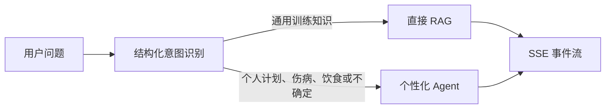
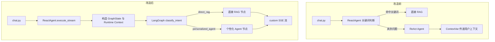
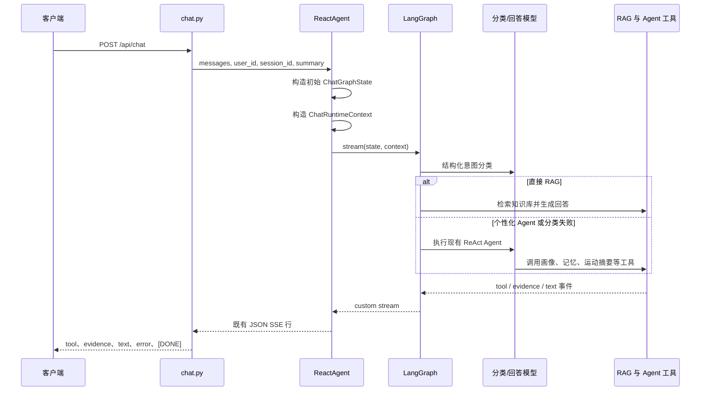
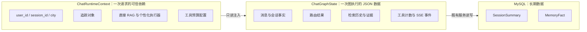
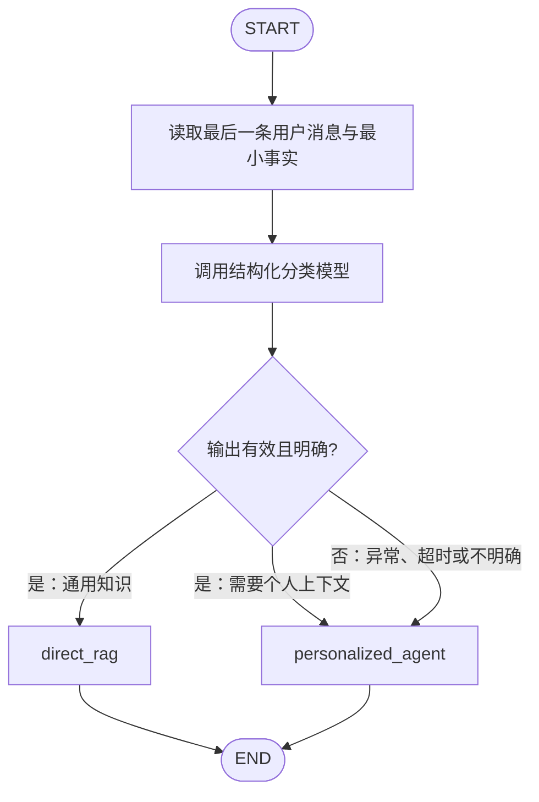
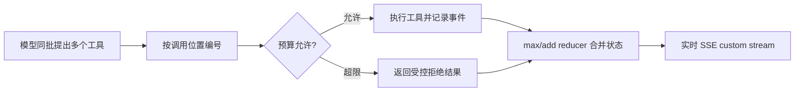

# LangGraph 聊天路由改造说明

## 改造目标

本次改造将聊天请求从关键词启发式分流升级为 LangGraph 图编排。系统根据 LLM 的结构化意图判断选择直接 RAG 或个性化 Agent，同时保持 `/api/chat` 的 SSE 协议、MySQL 长期记忆和既有工具能力不变。

## 改造前后

改造前，`ReactAgent` 根据中英文关键词决定是否走直接 RAG。关键词很难表达“这个动作适合我吗”这类同时包含知识与个人上下文的问题，并且请求信息需要经进程级 `ContextVar` 传递给工具。

改造后，路由、短期状态与工具运行时数据的职责被明确拆分：

## 当前请求链路

`chat.py` 只负责会话保存和 SSE 响应；它将稳定的 `session_id` 传入 `ReactAgent.execute_stream`，不再承担城市提取或业务分流。

## 状态边界

一次请求内可序列化的数据放入 `ChatGraphState`；需要信任或不可序列化的对象仅通过 `ChatRuntimeContext` 注入。跨会话数据仍然只由 MySQL 管理。

这条边界带来三个约束：

- GraphState 不写入 API 密钥、数据库连接、权限或跨请求共享对象。
- 直接 RAG 与个性化 Agent 在写回状态前都校验 JSON 安全性。
- 不启用 LangGraph Store 或 checkpointer，避免与 MySQL 的会话摘要、确认记忆形成双写来源。

## 意图识别与保守回退

分类器使用模型的 `with_structured_output(IntentDecision)`，只接受两种结果：`direct_rag` 或 `personalized_agent`。分类提示词只包含最后一条用户消息和最小会话事实。

因此，训练计划、伤病、饮食、历史训练数据、个人目标和任何模糊问题都会走个性化 Agent；模型不可用或输出不合规时也会保守回退，不会中断聊天。

## SSE 实时性与工具并发

图节点使用 LangGraph custom stream，在工具事件生成时立即输出，而不是等待整个节点结束后再回放状态。因此即使后续模型或检索发生异常，已经产生的 `tool` 或 `evidence` 事件仍会先到达客户端，之后再输出 `error` 与 `[DONE]`。

同一条模型消息可以并行提出多个工具调用。系统使用工具在当前批次中的稳定位置计算预算序号，并用 reducer 合并并行状态更新，避免多个工具同时写 `tool_call_count` 时触发状态冲突或绕过额度。

## 主要代码职责

| 文件 | 职责 |
| --- | --- |
| `app/services/chat_routing_graph.py` | GraphState、运行时上下文、结构化分类、条件边与两个图节点。 |
| `app/services/react_agent.py` | 图执行门面、Direct RAG 执行器、内层 ReAct Agent 与 SSE 事件适配。 |
| `app/services/agent_tools.py` | 从 `ToolRuntime` 读取当前请求上下文，并把检索产物写回本次 Agent 状态。 |
| `app/services/middleware.py` | 工具预算、并行调用序号、审计日志和受控错误处理。 |
| `app/api/routers/chat.py` | 会话持久化与 SSE 响应，不承担聊天业务路由。 |

## 兼容性与验证

- `/api/chat` 的请求结构和 SSE 事件类型保持兼容。
- 客户端仍按 `tool`、`evidence`、`text`、`error` 和 `[DONE]` 消费流。
- 完整后端测试在合并前通过：147 项通过；警告仅来自既有依赖弃用提示和本地 Qdrant 的 payload-index 限制。
- `ruff check`、指定修改文件的 `ruff format --check`、编译检查和 `git diff --check` 均已通过。
