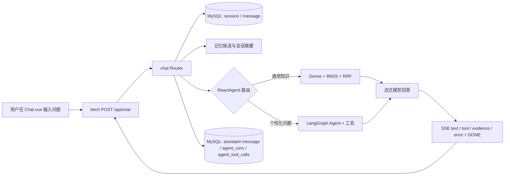
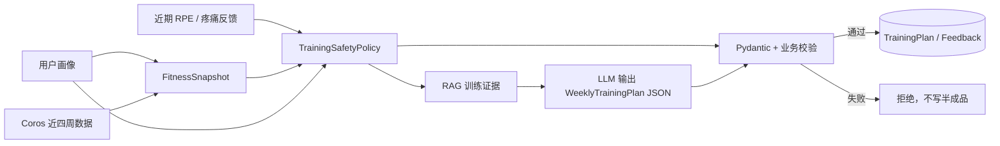
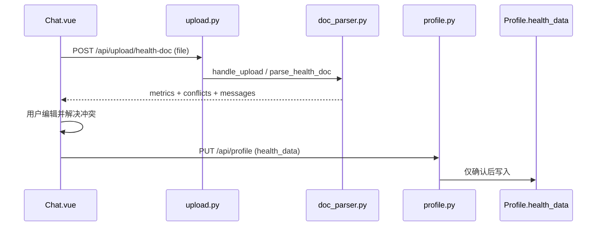

# FitAgent 代码学习路线：从一条请求串起整个项目

> 目标：不是背目录，而是能够从用户动作出发，追踪数据经过前端、API、业务服务、外部依赖和数据库的全过程，并在面试中讲清楚“为什么这样设计”。
>
> 推荐顺序：先完成第 1 阶段的一条聊天主链路，再按阶段阅读。不要一开始通读 `app/models.py`、所有 Router 或全部前端页面。

## 0. 先建立全局地图（20 分钟）

先读本 README 的项目能力与目录说明，然后只浏览下面这些入口，不深入实现：

| 入口 | 先确认的问题 |
| --- | --- |
| [frontend/src/main.js](../frontend/src/main.js)、[router/index.js](../frontend/src/router/index.js) | Vue 从哪里启动，哪个页面负责聊天？ |
| [frontend/src/views/Chat.vue](../frontend/src/views/Chat.vue) | 用户点击发送后，发往哪个 API，如何消费 SSE？ |
| [frontend/src/components/Sidebar.vue](../frontend/src/components/Sidebar.vue) | 会话列表从哪里加载、如何新建/切换/删除会话？ |
| [app/main.py](../app/main.py) | FastAPI 如何启动、注册路由、关闭 Coros 子进程？ |
| [app/api/routers/chat.py](../app/api/routers/chat.py) | `POST /api/chat` 如何接住一次聊天？ |
| [app/services/react_agent.py](../app/services/react_agent.py) | 请求如何通过 LangGraph 图分为 Direct RAG 与个性化 Agent？ |

此时只需要记住边界：**前端负责交互和流式渲染，Router 负责 HTTP/鉴权/事务边界，Service 负责业务编排，Repository 或 Adapter 负责数据库与第三方系统。**



## 1. 第一条主线：追踪一次通用健身问答（60–90 分钟）

这是最值得先掌握的事件流。启动项目并在聊天页问：`深蹲前怎样热身？`。该问题通常会命中 **Direct RAG**，比完整 Agent 链路短，最适合理解核心 RAG。

### 按顺序阅读

1. [Chat.vue](../frontend/src/views/Chat.vue) 的 `sendMessage`：确认它使用 `fetch` 发送 JWT、`message` 和 `session_id`，再用 `ReadableStream` 逐段解析 SSE。
2. [chat.py](../app/api/routers/chat.py) 的 `chat`：依次完成参数校验、创建/校验会话、持久化用户消息、创建记忆候选、读取历史、刷新会话摘要，然后返回 `StreamingResponse`。
3. 同文件的 `sse_generator`：它在请求开始时创建 LangChain 官方 `RunCollectorCallbackHandler`，把它经 `RunnableConfig.callbacks` 传给图；随后把同步生成器放到 executor 中逐块取值，转换为 `text`、`tool`、`evidence`、`error` 四类 SSE 事件。正常结束额外发送 `[DONE]`，前端在 `[DONE]` 或 `error` 时收敛加载状态；SSE 流结束后，才将 Collector 在内存中的运行树投影到既有 MySQL `agent_runs`、`agent_tool_calls`，并持久化 assistant 回复。这里不使用 LangSmith，也不新增日志表或路由。
4. [react_agent.py](../app/services/react_agent.py) 的 `execute_stream`：它构造 `ChatRuntimeContext` 与初始 `ChatGraphState`，消费图的 custom stream，再编码为既有 SSE JSON 行。
5. [chat_routing_graph.py](../app/services/chat_routing_graph.py)：`StateGraph` 先让模型以结构化 `IntentDecision` 分类；明确的通用知识进入 Direct RAG，个性化、模糊或分类失败都进入个性化 Agent。Direct RAG 先发“检索知识库”事件，发送真实证据卡片，再流式生成答案。
6. [rag_service.py](../app/services/rag_service.py) 的 `RagSummarizeService.build_context`：查看查询规划、Dense/BM25 召回、RRF 融合、去重、轻量重排与上下文预算如何产出 `RagContext`。

### 要追踪的三个数据

| 数据 | 产生位置 | 去向 | 你应能解释的价值 |
| --- | --- | --- | --- |
| `session_id` | `chat()` | 响应头 `X-Session-Id` 与 `sessions/messages` | 新会话与后续多轮会话如何关联 |
| `RagContext.result.hits` | `RagSummarizeService` | `build_evidence_cards` → 前端证据卡片 | 证据来自真实检索，不靠解析模型文本猜测 |
| SSE `type` | `ReactAgent` / `sse_generator` | `sse_generator` → `Chat.vue` | 工具状态、证据、模型增量文本与服务异常为何可以分别渲染，并由 `[DONE]` 收口 |

### 这阶段的完成标准

你能不看代码讲出：

> “用户问题先被存为消息，再产生待确认记忆候选；`ReactAgent` 将短期状态交给 StateGraph，由结构化分类决定 Direct RAG 或个性化 Agent。分类异常保守进入个性化分支；两条分支都把真实证据与回答增量通过 SSE 回给前端。流结束后再存 assistant 消息，并把官方 Collector 的内存运行树投影为本地 `agent_runs`、`agent_tool_calls` 记录。”

先跑这些测试巩固，不需要真实 LLM：

```powershell
.\.venv\Scripts\python.exe -m pytest app/tests/test_chat.py app/tests/test_direct_rag_router.py app/tests/test_online_rag_pipeline.py -q
```

## 2. 第二条主线：个性化问题如何进入 Agent（45–60 分钟）

改问：`结合我的膝盖情况和最近训练数据，安排今天的训练。` 这会绕过 Direct RAG，进入 LangGraph Agent。此时不要试图读懂 LangGraph 内部实现，先关注**本项目给模型什么工具、什么上下文、什么预算**。

1. 回看 `ReactAgent.execute_stream` 与 [chat_routing_graph.py](../app/services/chat_routing_graph.py)：入口只注入 `ChatRuntimeContext`（身份、城市和依赖）与 JSON 安全的短期 `ChatGraphState`；个性化节点把同一个 context 传给内层 Agent。运行记录不在 context 中：HTTP 层把官方 Collector 放入 `RunnableConfig.callbacks`。
2. 看 [agent_tools.py](../app/services/agent_tools.py)：重点查看 `rag_summarize`、`get_user_profile`、`get_confirmed_memories`、`get_fitness_summary`。它们通过 `ToolRuntime` 读取请求上下文、把证据等短期产物写回 state。
3. 看 [middleware.py](../app/services/middleware.py)：理解递归步数、按同批工具位置计算的预算、脱敏审计分别在哪里被约束；并行工具调用的状态更新由 reducer 合并。
4. 看 [repositories/agent_trace_repository.py](../app/repositories/agent_trace_repository.py)：理解 `RunCollectorCallbackHandler` 如何只在本次请求内存中收集根运行和工具运行，并在 SSE 结束后投影到既有 `agent_runs`、`agent_tool_calls`。记录包含用户问题、最终回答、工具输入和工具输出；不接入 LangSmith，也不增加日志表或查询路由。

`get_fitness_summary` 不接受模型传入的用户 ID。默认读取近 4 周；给出不同的 `start_day` / `end_day` 时读取最多 90 天的闭区间。若两个日期相同，第一次调用会列出当天活动的稳定 `activity_id` 候选，模型必须携带该 ID 再调用一次才能读取某次活动，不能仅按日期猜测晨跑或夜跑。

这阶段最重要的判断是：**Agent 不是拥有全部数据库权限的万能类；它只能调用在 `agent_tools.py` 中显式注册的只读/受限工具。**

建议测试：

```powershell
.\.venv\Scripts\python.exe -m pytest app/tests/test_agent_execution_policy.py app/tests/test_agent_rag_context.py app/tests/test_agent_trace.py -q
```

自测问题：为什么“给我制定计划”不应靠聊天 Agent 直接写入训练计划表？答案要落到“显式 API、结构化契约、确定性安全策略和事务边界”。

## 3. 读 RAG 时必须区分离线与在线（60 分钟）

许多面试讲不清 RAG，是因为把“导入知识”和“回答时检索”混为一谈。这里要从两个方向读。

| 路径 | 主要文件 | 一句话职责 |
| --- | --- | --- |
| 离线构建 | [knowledge_preflight.py](../app/services/knowledge_preflight.py) → [knowledge_indexer.py](../app/services/knowledge_indexer.py) → [vector_repository.py](../app/services/vector_repository.py) | 校验知识源，构建 Qdrant revision 与 BM25 工件，校验后切换 `rag_active` alias |
| 在线检索 | [rag_service.py](../app/services/rag_service.py) → [vector_store.py](../app/services/vector_store.py) / [bm25_retriever.py](../app/services/bm25_retriever.py) | 使用当前 alias 做 Dense/BM25 双路召回、RRF、重排和上下文裁剪 |

建议按这个顺序提问自己：

1. 为什么不直接覆盖旧 Qdrant collection？——revision + alias 让线上始终读到一套完整索引。
2. 为什么 BM25 要有离线工件并检查 revision？——避免词法索引和向量索引对应不同版本知识。
3. 为什么使用 RRF 而不混合相似度分数？——不同检索器分数没有可比的量纲，按排名融合更稳妥。
4. 为什么上下文要预算？——召回多不等于应该全部塞给模型，需控制成本与噪声。

配合阅读 [test_retrieval_evaluator.py](../app/tests/test_retrieval_evaluator.py)。

## 4. 重点补课：记忆不是“全量聊天记录”（45–60 分钟）

从 [memory_service.py](../app/services/memory_service.py) 和 [session_facts.py](../app/services/session_facts.py) 开始，再看 [memory.py](../app/api/routers/memory.py) 与 [test_memory.py](../app/tests/test_memory.py)。

| 层级 | 表/载体 | 如何写入 | 是否直接给 Agent |
| --- | --- | --- | --- |
| 近期上下文 | `messages` 最近 10 轮（20 条） | 聊天原文 | 是，当前会话内 |
| 会话暂存状态 | `session_summaries` | 仅从较早的 user 消息确定性提取，可重建 | 是，但标注来源与时效 |
| 长期记忆 | `memory_facts` | `proposed → confirmed/revoked`，由用户在页面确认 | 仅 `confirmed`、未过期、最多 6 条 |

一定要追踪这条防污染规则：`chat()` 在模型生成前只从**用户本条消息**产生候选；`extract_session_facts` 忽略 `assistant/tool` 消息。因此模型不能通过“我猜你膝盖受伤”把猜测反写成用户事实。

完成标准：你能解释“为什么摘要不是长期记忆”“为什么候选不能直接提供给 Agent”“确认新值如何撤销 `supersedes_id` 指向的旧值”。

## 5. 训练计划是一条独立、安全优先的业务链路（60 分钟）

从 [training_plans.py](../app/api/routers/training_plans.py) 进入 [training_plan_service.py](../app/services/training_plan_service.py)，然后读 [fitness_insights.py](../app/services/fitness_insights.py) 与 [schemas.py](../app/schemas.py) 中的 `WeeklyTrainingPlan`。



阅读时只关注顺序不能颠倒：先 `TrainingSafetyPolicy.assess` 计算最大强度，再调用模型；之后 `_validate_plan` 校验 7 天覆盖、训练天数、动作强度和证据 ID。Prompt 只能引导模型，不能替代业务门禁。

建议测试：

```powershell
.\.venv\Scripts\python.exe -m pytest app/tests/test_training_safety.py app/tests/test_training_plans.py app/tests/test_fitness_summary.py -q
```

## 6. Coros：把 MCP 当外部适配器，而不是 Agent 工具（45 分钟）

从 [fitness.py](../app/api/routers/fitness.py) 开始，依次读 [coros_client.py](../app/services/coros_client.py)、[core/deps.py](../app/core/deps.py)、[integrations/coros_mcp_runner.py](../app/integrations/coros_mcp_runner.py)。最后对照 [test_coros_client.py](../app/tests/test_coros_client.py) 和 [test_fitness.py](../app/tests/test_fitness.py)。

需要特别掌握的事件流：

1. 用户主动调用 `POST /api/fitness/sync`，默认同步最近 7 天；聊天 Agent 没有同步权限。
2. `CorosClient.sync_cache` 先关闭读取子进程，让 Provider Runner 独占刷新 SQLite 缓存。
3. Runner 保留 Windows 安全令牌路径，只重定向社区 MCP 的 SQLite cache 到项目 `.tools` 目录。
4. 缓存刷新后，stdio MCP 只读本地缓存，依次读取日指标、睡眠、活动并 upsert 到 MySQL。
5. 未佩戴手表导致睡眠数组为空是完整成功；只有真实上游错误才返回 `partial`，已成功的数据源仍会落库。
6. 活动按 `(user_id, data_type, external_id)` 幂等，而不是按日期，故同一天晨跑和夜跑不会互相覆盖。

日志出现“子进程不可用，正在重建连接”不一定是故障：显式同步主动关闭旧读取进程后，下一次读缓存会按设计完成握手重建。具体部署与边界可结合 `coros_client.py`、`coros_mcp_runner.py` 与对应测试阅读。

## 7. 健康文档：上传后必须由用户确认（30 分钟）

这条链路独立于首次建档：健康文件的选择、提取结果确认和画像写入都在 [Chat.vue](../frontend/src/views/Chat.vue)；[Onboarding.vue](../frontend/src/views/Onboarding.vue) 只负责基础画像表单。



按 `Chat.vue` 的 `handleFileSelect` → `upload.py` 的 `upload_health_doc` → `doc_parser.py` 的 `parse_health_doc` → `Chat.vue` 的 `confirmHealthData` → `profile.py` 阅读。回答时要强调：提取结果不是医疗诊断；用户取消、关闭或保留未解决冲突时，不会写入画像。

## 8. 最后再读数据模型、迁移、API 契约与前端页面（45 分钟）

此时再读 [models.py](../app/models.py)、[schemas.py](../app/schemas.py) 和 [alembic/versions](../alembic/versions)，你会知道每一张表和每个 Schema 为哪条事件流服务。

前端按用户闭环读：

1. [Onboarding.vue](../frontend/src/views/Onboarding.vue) / [Profile.vue](../frontend/src/views/Profile.vue)：画像；
2. [Dashboard.vue](../frontend/src/views/Dashboard.vue)：Coros 同步与图表；
3. [Memory.vue](../frontend/src/views/Memory.vue)：确认/撤销候选；
4. [TrainingPlan.vue](../frontend/src/views/TrainingPlan.vue)：显式生成计划和提交反馈；
5. [Chat.vue](../frontend/src/views/Chat.vue)：RAG/Agent/SSE/证据，以及健康文档的确认入口。

## 建议的 7 天学习安排

| 天 | 主题 | 可交付的口述结果 |
| --- | --- | --- |
| Day 1 | 架构与通用聊天主链路 | 用 3 分钟讲完一次 Direct RAG SSE 请求 |
| Day 2 | Agent 工具与执行轨迹 | 解释何时进入 Agent、工具为何受限 |
| Day 3 | 离线/在线 RAG | 解释 revision、alias、BM25、RRF 与证据卡片 |
| Day 4 | 三层记忆 | 解释候选—确认—撤销与防模型污染 |
| Day 5 | 训练计划 | 解释“先规则、后生成、再校验” |
| Day 6 | Coros/MCP 与幂等 | 解释 stdio 串行、缓存隔离、partial、external id |
| Day 7 | 演示与面试 | 参考 [interview/项目简介.md](./interview/项目简介.md) 演练，并回答 [interview/常见面试题.md](./interview/常见面试题.md) |

## 卡住时的排查顺序

1. **先确定用户动作对应哪个 HTTP API**：看浏览器 Network 或前端 `src/api/`。
2. **再找到 Router**：它定义鉴权、输入 Schema、HTTP/SSE 输出与事务边界。
3. **进入 Service，而不是直接钻第三方 SDK**：先理解本项目做了什么决策。
4. **查看同名测试**：测试通常比旧文档更能说明当前保证了什么边界。
5. **最后才看模型、Qdrant、MCP 的外部实现**：它们是依赖，不应模糊项目自己的责任边界。

学习过程中请始终用这五个问题检查一段代码：**谁调用它？输入从哪里来？它做出什么业务决策？状态写到哪里？失败时如何表现？** 只要能回答这五点，你就已经能把局部代码串回完整事件流。
