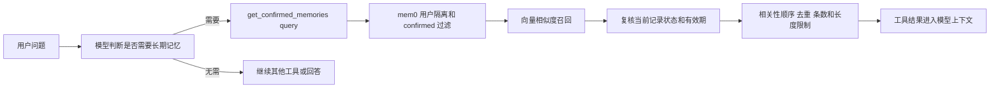

# mem0 用户可控长期记忆

## 存储与职责

| 组件 | 保存什么 | 边界 |
| --- | --- | --- |
| mem0 主向量库 | 正文、embedding、用户 ID、确认状态、来源与有效期 | 长期记忆唯一存储；与 RAG 集合分开 |
| mem0 Entity Store | 实体向量与 `linked_memory_ids` | 依赖实体提取配置；基础安装不承诺启用实体增强 |
| mem0 SQLite | 变更日志、每个 scope 最近 10 条消息 | 供提取与排错，不替代产品完整聊天 |
| FitAgent MySQL | 账号、完整消息、会话摘要、画像和训练业务 | 旧 memory_facts 仅供显式迁移，不再在线读写 |

版本固定为 `mem0ai==2.0.20`，直接使用开源 Python SDK。基础依赖不包含 NLP extras；当前重点是 LLM 提取与语义召回，中文效果需要按实际模型评估。

## 写入

1. 聊天接口先保存用户消息，取得稳定的会话和消息 ID。
2. 在线程池调用 `extract`，仅向 mem0 提交用户消息；会话 ID 限定提取上下文，来源消息 ID 用于幂等检查。
3. mem0 通过 LLM 生成候选，元数据强制为 `status=proposed`、`source=chat`、`source_message_id`、`expires_at`。模型不能选择确认状态。
4. 用户在原有“我的记忆”页面确认或撤销。接口修改 mem0 元数据，不复制到另一张业务表。
5. 用户通过 POST 主动添加的记忆直接确认，使用 `infer=False` 保存原文。模型没有长期记忆写入工具。

候选默认有效期为 90 天，可配置。API 接受带时区的日期，服务转换为 UTC 校验，并在响应中显式标注 UTC；页面按浏览器本地日期展示。明确提交 `expires_at=null` 可取消到期限制。编辑文本同时更新响应中的 value，避免正文与值不一致。

SDK `add` 的自动提取是 ADD-only。不同源消息可能形成相似或冲突候选，用户需要在页面审核和撤销旧项；不保证通过添加新事实自动覆盖全部旧事实。不要把正文中的指令当成系统指令。

## 读取



没有个人关键词硬门槛，也不增加 LangGraph 自动查询节点。`MEMORY_TOP_K` 控制最终条数；检索适当多取候选用于过滤，`MEMORY_SCORE_THRESHOLD` 控制最低分，`MEMORY_CONTEXT_MAX_CHARS` 控制工具文本字符预算。召回为空不会退回“最近 6 条”，避免补入无关事实。

工具对召回结果再次读取当前记录，防止使用已撤销的状态或旧文本。已经交给一次在途模型调用的内容无法追溯撤回。管理列表默认不展示撤销项，支持 `include_revoked=true`。

同一记忆的管理更新从读取状态、校验到写入使用进程内互斥锁，避免并发确认或编辑覆盖撤销。当前按 README 的单 worker 方式运行；部署多个 worker 或实例前，需要引入跨进程的原子状态更新或协调机制，进程内锁不能提供分布式互斥。

## 配置和运行

连接复用项目的 DashScope 与 Qdrant 配置；记忆模型可用 `MEMORY_LLM_MODEL`、`MEMORY_EMBEDDING_MODEL` 独立覆盖，留空时从 `config/models.yml` 派生。默认嵌入维度 1536 对应 `text-embedding-v1`。切换模型维度必须使用新集合前缀并迁移数据，不要对现有集合混写向量。

`MEMORY_STORAGE_PATH` 默认 `storage/memory`，`MEMORY_COLLECTION_PREFIX` 默认 `fitagent_memory`，主集合为 `fitagent_memory_main`。SQLite 与向量集合均应持久化备份。SDK 延迟初始化，项目不向 mem0 发送遥测；提取仍会向配置的模型提供商发送用户文本。

LLM 提取在线程池中等待完成后才开始当前 SSE 回答，因此会增加首段响应等待。`MEMORY_TIMEOUT_SECONDS` 和 `MEMORY_MAX_RETRIES` 限制外部调用；它们是单次调用配置，不是整轮提取的总时限。暂不添加任务队列。

提取失败记录脱敏错误且继续聊天。查询故障返回“暂时不可用”，不能解释为没有相关记忆。管理失败返回 503，用户可重试；SDK 的主库更新与 SQLite 日志不具备跨存储事务原子性，错误后的状态需重新读取确认。超过 `MEMORY_MAX_LIST_ITEMS` 时列表明确失败，不静默漏项。

适配器接管 mem0 日志命名空间，只保留事件级别、模块、函数与行号，不转发记忆正文、异常正文或堆栈；业务层另记操作名与异常类型。不影响其他应用日志。

## 旧数据迁移

```powershell
# 默认预览，不初始化写入，也不改源表
.\.venv\Scripts\python.exe -m app.services.memory_migration --user-id 1
# 明确迁移；省略 user-id 表示选择所有用户
.\.venv\Scripts\python.exe -m app.services.memory_migration --user-id 1 --apply
```

迁移保留状态、有效期、来源和 `legacy_id`，重复执行按用户与 legacy_id 去重。源表不删除，源数据不更新。旧无时区日期按执行迁移的服务器本地时区转为 UTC，因此应在与旧部署一致的时区运行。

## 验证

服务与 HTTP 测试注入外部后端；SDK 测试使用确定性模型和本地 Qdrant，不写入真实用户的记忆集合。

```powershell
.\.venv\Scripts\python.exe -m pytest app/tests/test_memory.py app/tests/test_memory_service.py app/tests/test_mem0_backend.py app/tests/test_memory_migration.py app/tests/test_chat.py -q -p no:cacheprovider
```

另已使用配置的真实 DashScope 模型与 embedding、隔离的本地 Qdrant 做中文冒烟验证：从“偏好早晨跑步，目标完成半程马拉松”提取两条候选，确认后语义命中两条，其他用户不可读，撤销后无法召回。该样例证明基本链路可用；模型是否在需要时调用工具，以及中文召回准确率、无关召回比例和延迟，仍需用独立评测集衡量。
