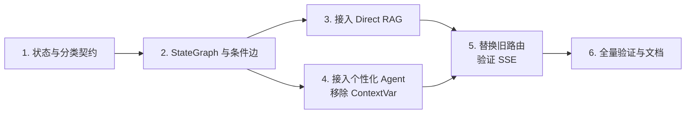
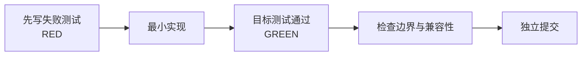

# LangGraph Routing Graph Implementation Plan

> **For agentic workers:** REQUIRED SUB-SKILL: Use superpowers:executing-plans to implement this plan task-by-task.

**Goal:** 以 LangGraph `StateGraph` 统一管理一次聊天请求的短期状态，用 LLM 结构化意图识别替换 Direct RAG 的关键词路由，同时保持现有 FastAPI/SSE 接口和 MySQL 长期记忆兼容。

**Architecture:** `chat.py:sse_generator` 将稳定的 `session_id` 传给 `ReactAgent.execute_stream`；该入口在构造完整初始状态的同时，创建 `ChatRuntimeContext`，并以 `routing_graph.stream(initial_state, context=runtime_context)` 注入图。图从意图分类节点直接开始，条件边进入直接 RAG 节点或现有 LangChain Agent 个性化节点。图仅保存本次运行的瞬态信息；身份、配置、数据库依赖和长期记忆仍经 `Runtime.context` 与既有服务传递。SSE 层继续消费相同的事件协议。

**Tech Stack:** Python 3.11、LangGraph 1.2.0、LangChain 1.3.1、Pydantic 2.13、FastAPI、pytest。

**Spec:** `docs/superpowers/specs/2026-09-02-langgraph-routing-design.md`

## 实施一图



每个任务均遵循同一个闭环：



## 全局约束

- 不修改 `/api/chat` 的 HTTP 请求、响应或 SSE 事件对外契约。
- `GraphState` 只保存一次运行中的可序列化短期数据；不写入 API 密钥、数据库连接、权限或跨请求共享的可变对象。
- `MemoryFact` 与 `SessionSummary` 的 MySQL 服务仍是长期状态唯一来源；本次不启用 LangGraph Store 或 checkpointer。
- 仅当分类器明确识别为无个人上下文的知识问答时才走 `direct_rag`；任何模糊、异常或校验失败均回退到 `personalized_agent`。
- 所有分类、图路由、工具和 SSE 测试均使用 fake/mock；不得在测试中访问真实 LLM、数据库或第三方天气 API。

---

### Task 1: 建立可测试的状态与意图分类契约

**Files:**

- Create: `app/services/chat_routing_graph.py`
- Modify: `app/tests/test_direct_rag_router.py`
- Modify: `app/tests/test_agent_execution_policy.py`

**Step 1: 编写失败测试（RED）**

在 `test_direct_rag_router.py` 增加以下场景，使用可注入的假分类器，不创建真实 `ChatTongyi`：

```python
def test_classifier_routes_generic_knowledge_question_to_direct_rag(): ...
def test_classifier_routes_personalized_question_to_agent(): ...
def test_classifier_failure_falls_back_to_personalized_agent(): ...
def test_invalid_structured_result_falls_back_to_personalized_agent(): ...
```

断言结果仅能为 `"direct_rag"` 或 `"personalized_agent"`，后两种异常场景固定为后者。

**Step 2: 运行测试以确认失败**

Run: `./.venv/Scripts/python.exe -m pytest app/tests/test_direct_rag_router.py -q`

Expected: 失败，提示路由图模块或 `IntentDecision` 尚不存在。

**Step 3: 实现最小契约**

在 `app/services/chat_routing_graph.py` 定义：

- `IntentDecision(BaseModel)`，用 `Literal["direct_rag", "personalized_agent"]` 限制 LLM 输出；
- `ChatGraphState(TypedDict)`，至少包括 `messages`、`session_facts`、`session_summary`、`retrieval_history`、`route`、`rag_evidence`、`tool_call_count` 与 `events`；
- `ChatRuntimeContext` 数据类，承载 `user_id`、`city`、`session_id`、追踪对象及执行依赖；
- `IntentClassifier` 协议和一个适配 `model.with_structured_output(IntentDecision)` 的实现；
- 保守的 `classify_intent`：验证输入和输出，捕获模型/校验异常并固定返回 `personalized_agent`。

分类提示词只包含最后一条用户消息与最小化会话事实，明确说明伤病、训练目标、饮食、计划、历史记录或不确定情况应选择个性化分支。

**Step 4: 运行测试确认通过（GREEN）**

Run: `./.venv/Scripts/python.exe -m pytest app/tests/test_direct_rag_router.py -q`

Expected: 新增的四个分类测试通过。

**Step 5: 提交**

```powershell
git add app/services/chat_routing_graph.py app/tests/test_direct_rag_router.py app/tests/test_agent_execution_policy.py
git commit -m "feat: add typed intent routing contract"
```

---

### Task 2: 以 StateGraph 编排初始状态、分类与条件边

**Files:**

- Modify: `app/services/chat_routing_graph.py`
- Modify: `app/tests/test_direct_rag_router.py`
- Create: `app/tests/test_chat_routing_graph.py`

**Step 1: 编写失败测试（RED）**

覆盖入口构造的初始状态与图的两个条件边：

```python
def test_build_initial_state_writes_session_facts_and_empty_artifacts(): ...
def test_graph_selects_direct_rag_edge_for_generic_intent(): ...
def test_graph_selects_personalized_agent_edge_for_personal_intent(): ...
def test_state_does_not_contain_runtime_identity_or_secret_values(): ...
def test_graph_node_receives_runtime_context_from_graph_invocation(): ...
```

最后一个测试传入 `ChatRuntimeContext(user_id="u-1", ...)` 后断言其身份信息不被节点写入 `ChatGraphState`。

**Step 2: 运行测试以确认失败**

Run: `./.venv/Scripts/python.exe -m pytest app/tests/test_chat_routing_graph.py -q`

Expected: 失败，因为图和节点尚未建立。

**Step 3: 实现最小图**

在图外提供纯函数 `build_initial_chat_state`，由 `ReactAgent.execute_stream` 在调用图前执行。它负责标准化消息、复用/提取 `session_facts.py` 的确定性事实、写入会话摘要，并初始化空的检索历史、证据、工具计数与事件列表。

在 `build_chat_routing_graph` 中用 `StateGraph(ChatGraphState, context_schema=ChatRuntimeContext)` 创建并编译：

1. 以 `START -> classify_intent` 直接连接图入口；`classify_intent` 调用 Task 1 的分类器，并只写入 `route`；
2. `route_after_classification`：将 `direct_rag` 指到直接检索节点，其他任何值都指到个性化节点；
3. 两个执行节点先以可注入 stub 建立接口，再在下一任务接入真实流程。

保持初始状态和节点更新字段为显式、受类型约束的数据；运行时上下文只能从 `runtime.context` 读取，不复制进状态。此任务的图级测试用 `graph.invoke(..., context=ChatRuntimeContext(...))` 证明节点确实收到同一个请求上下文。

**Step 4: 运行测试确认通过（GREEN）**

Run: `./.venv/Scripts/python.exe -m pytest app/tests/test_chat_routing_graph.py app/tests/test_direct_rag_router.py -q`

Expected: 初始状态构造、图构建、两条边和隔离测试全部通过。

**Step 5: 提交**

```powershell
git add app/services/chat_routing_graph.py app/tests/test_chat_routing_graph.py app/tests/test_direct_rag_router.py
git commit -m "feat: add langgraph intent routing graph"
```

---

### Task 3: 将直接 RAG 分支接入图并保持事件顺序

**Files:**

- Modify: `app/services/react_agent.py`
- Modify: `app/services/chat_routing_graph.py`
- Modify: `app/tests/test_direct_rag_router.py`
- Modify: `app/tests/test_agent_rag_context.py`

**Step 1: 编写失败测试（RED）**

迁移现有 Direct RAG 覆盖到图执行器，保留并补充断言：

```python
def test_direct_rag_graph_emits_tool_evidence_then_text(): ...
def test_direct_rag_graph_records_retrieval_history_in_state(): ...
def test_direct_rag_graph_marks_trace_mode_direct_rag(): ...
```

使用假的 RAG 检索器与模型流，断言 `tool -> evidence -> text` 的原有顺序，不允许调用完整 Agent。

**Step 2: 运行测试以确认失败**

Run: `./.venv/Scripts/python.exe -m pytest app/tests/test_direct_rag_router.py app/tests/test_agent_rag_context.py -q`

Expected: 失败，因为图节点尚未调用当前 `_execute_direct_rag` 的真实逻辑。

**Step 3: 抽取并接入直接 RAG 节点**

- 从 `ReactAgent._execute_direct_rag` 抽取无 HTTP 依赖的检索和事件生成协作对象；
- 直接 RAG 图节点将检索历史、RAG 证据写入 `ChatGraphState`，并通过图的自定义流输出（或单独事件适配器）传出既有 JSON 事件；
- 调用现有模型流生成最终文本，标记 `AgentTrace.mode = "direct_rag"`；
- 删除 `execute_stream` 中由 `_should_use_direct_rag` 控制的提前分支，但暂不删除已被其他测试依赖的辅助函数，待 Task 5 完整替换后清理。

**Step 4: 运行测试确认通过（GREEN）**

Run: `./.venv/Scripts/python.exe -m pytest app/tests/test_direct_rag_router.py app/tests/test_agent_rag_context.py -q`

Expected: 直接 RAG 的事件顺序、检索历史与 trace 断言全部通过。

**Step 5: 提交**

```powershell
git add app/services/react_agent.py app/services/chat_routing_graph.py app/tests/test_direct_rag_router.py app/tests/test_agent_rag_context.py
git commit -m "refactor: run direct rag through langgraph"
```

---

### Task 4: 接入个性化 Agent 分支并去除 ContextVar 状态桥接

**Files:**

- Modify: `app/services/react_agent.py`
- Modify: `app/services/middleware.py`
- Modify: `app/services/agent_tools.py`
- Modify: `app/services/chat_routing_graph.py`
- Modify: `app/tests/test_agent_execution_policy.py`
- Modify: `app/tests/test_agent_rag_context.py`
- Create: `app/tests/test_agent_runtime_context.py`

**Step 1: 编写失败测试（RED）**

新增请求隔离与个性化分支测试：

```python
def test_personalized_graph_branch_invokes_existing_agent_with_runtime_context(): ...
def test_tool_runtime_reads_user_and_city_without_contextvar(): ...
def test_parallel_requests_do_not_share_retrieval_history_or_evidence(): ...
def test_personalized_branch_marks_trace_mode_agent(): ...
```

测试必须让两个不同 `user_id` 的假请求交错执行，以验证个人资料、城市、检索历史和证据不会泄漏。

**Step 2: 运行测试以确认失败**

Run: `./.venv/Scripts/python.exe -m pytest app/tests/test_agent_execution_policy.py app/tests/test_agent_rag_context.py app/tests/test_agent_runtime_context.py -q`

Expected: 失败，因为工具仍经 `_user_context` 的 `ContextVar` 获取请求信息。

**Step 3: 迁移运行时依赖与个性化节点**

- 为内层 `create_agent` 声明与 `ChatRuntimeContext` 对应的 `context_schema`；`personalized_agent` 节点必须以 `self.agent.stream(..., context=runtime.context, ...)` 转发外层已注入的上下文。用户 ID、城市、追踪对象和依赖均不得重新从全局变量读取；会话摘要保留在 `ChatGraphState`；
- 为需要读取或更新短期产物的工具/中间件使用 LangChain 的 `ToolRuntime` / 请求状态，而不是进程级 `_user_context`；RAG 证据和检索历史只更新本次运行对应的状态或事件收集器；
- 个性化图节点复用已有 `self.agent.stream(...)` 的工具循环、`recursion_limit` 与中间件，不重复实现工具选择；
- 保持 `monitor_tool` 的调用上限、审计与错误处理语义，确保模型无法在状态中覆盖身份或权限；
- 删除 `agent_tools.py` 和 `middleware.py` 中不再使用的 `_user_context` 读写与 reset 逻辑。

实现前先在当前 LangChain/LangGraph 锁定版本上确认 `ToolRuntime`、中间件请求状态与 `create_agent(context_schema=...)` 的可用接口；不要按照未验证的高版本 API 名称编码。

**Step 4: 运行测试确认通过（GREEN）**

Run: `./.venv/Scripts/python.exe -m pytest app/tests/test_agent_execution_policy.py app/tests/test_agent_rag_context.py app/tests/test_agent_runtime_context.py -q`

Expected: 运行时隔离、工具上下文、个性化调用与原有执行策略测试均通过。

**Step 5: 提交**

```powershell
git add app/services/react_agent.py app/services/middleware.py app/services/agent_tools.py app/services/chat_routing_graph.py app/tests/test_agent_execution_policy.py app/tests/test_agent_rag_context.py app/tests/test_agent_runtime_context.py
git commit -m "refactor: pass agent request state through runtime"
```

---

### Task 5: 用图执行器替换 ReactAgent 关键词分支并验证 SSE 兼容

**Files:**

- Modify: `app/services/react_agent.py`
- Modify: `app/api/routers/chat.py`
- Modify: `app/tests/test_chat.py`
- Modify: `app/tests/test_direct_rag_router.py`
- Modify: `README.md`

**Step 1: 编写失败测试（RED）**

增加端到端（mock 模型）适配测试：

```python
def test_chat_sse_contract_is_unchanged_for_direct_rag_route(): ...
def test_chat_sse_contract_is_unchanged_for_personalized_route(): ...
def test_classifier_exception_returns_successful_personalized_sse_flow(): ...
def test_execute_stream_no_longer_uses_keyword_router(): ...
```

断言聊天路由仍保存消息、传递会话摘要与事实，并可在 `tool`、`evidence`、`text`、`done` 事件中被现有客户端消费。

**Step 2: 运行测试以确认失败**

Run: `./.venv/Scripts/python.exe -m pytest app/tests/test_chat.py app/tests/test_direct_rag_router.py -q`

Expected: 失败，因为 `ReactAgent.execute_stream` 仍含旧关键词判定或图事件尚未被转换为 SSE 事件。

**Step 3: 完成入口迁移**

- `ReactAgent.execute_stream` 成为图执行的兼容门面：构造初始 `ChatGraphState` 与 `ChatRuntimeContext`、消费图流、输出与当前格式完全一致的 JSON 行；
- `chat.py:sse_generator` 仅将当前会话的稳定 `session_id` 传给 `ReactAgent.execute_stream`；不创建 `Runtime.context`，也不在路由器中放业务分支；
- `ReactAgent.execute_stream` 是唯一注入点：它调用 `build_initial_chat_state(...)`，构造 `ChatRuntimeContext(user_id, session_id, city, trace, dependencies)`，随后调用 `routing_graph.stream(initial_state, context=runtime_context, ...)`；
- 删除 `_KNOWLEDGE_TERMS`、`_PERSONALIZATION_TERMS`、`_should_use_direct_rag` 以及已无引用的旧控制流；
- 在 `README.md` 中新增简短架构说明：短期状态在 LangGraph、长期记忆在 MySQL、分类失败保守回退。

**Step 4: 运行测试确认通过（GREEN）**

Run: `./.venv/Scripts/python.exe -m pytest app/tests/test_chat.py app/tests/test_direct_rag_router.py -q`

Expected: 两条图路径均保持 SSE 契约，且没有旧关键词路由引用。

**Step 5: 提交**

```powershell
git add app/services/react_agent.py app/api/routers/chat.py app/tests/test_chat.py app/tests/test_direct_rag_router.py README.md
git commit -m "feat: route chat requests with langgraph"
```

---

### Task 6: 全量回归、静态检查与文档核对

**Files:**

- Modify: `README.md`
- Modify: `docs/superpowers/specs/2026-09-02-langgraph-routing-design.md`
- Modify: `docs/superpowers/plans/2026-09-02-langgraph-routing.md`

**Step 1: 执行目标测试集**

Run: `./.venv/Scripts/python.exe -m pytest app/tests/test_chat.py app/tests/test_direct_rag_router.py app/tests/test_agent_execution_policy.py app/tests/test_agent_rag_context.py app/tests/test_agent_runtime_context.py app/tests/test_chat_routing_graph.py -q`

Expected: 全部通过。

**Step 2: 执行全量测试和格式检查**

Run: `./.venv/Scripts/python.exe -m pytest -q`

Expected: 全量测试通过；若 `.pytest_cache` 仍有本机权限警告，记录为环境噪声，但不得掩盖测试失败。

Run: `./.venv/Scripts/python.exe -m compileall app`

Expected: 所有应用模块可编译且无语法错误。

如项目已定义 Ruff、Black 或其他 lint/format 命令，再按 `pyproject.toml` 的真实配置运行；不凭空添加门禁。

**Step 3: 人工检查**

Run: `git diff main -- app/services/react_agent.py app/services/chat_routing_graph.py app/services/middleware.py app/services/agent_tools.py app/api/routers/chat.py`

Expected: 确认无密钥进入状态、无 `ContextVar` 请求桥接残留、无关键词路由残留，并且 API 路由没有越过服务层承担业务决策。

**Step 4: 同步文档并提交**

确认 README 与设计文档准确描述最终接口和实际行为；若实现期间发生设计调整，更新本计划的“实施结果”小节并说明原因。

```powershell
git add README.md docs/superpowers/specs/2026-09-02-langgraph-routing-design.md docs/superpowers/plans/2026-09-02-langgraph-routing.md
git commit -m "docs: document langgraph chat routing"
```

## 计划自检

- 已明确由入口构造短期 `GraphState`、请求级 `Runtime.context` 和 MySQL 长期记忆的边界。
- 已将 LLM 分类输出限制为 Pydantic 枚举，并定义保守回退策略。
- 每个实现任务都先新增失败测试，再最小实现、验证并提交。
- 已列出精确文件、测试命令、SSE 兼容要求和清理旧关键词路由的时机。

## 实施结果

- `ReactAgent.execute_stream` 已成为唯一的图调用门面：它构造初始 `ChatGraphState` 与 `ChatRuntimeContext`，并将图的自定义事件重新编码为既有 JSON SSE 行。
- 直接 RAG 与个性化 Agent 分支均通过图的 `custom` 流实时输出 `tool`、`evidence`、`text` 事件；此实现采用计划中约定的“自定义流输出或适配层”方案，未改变 HTTP/SSE 对外契约。
- 内层 Agent 以 `context_schema=ChatRuntimeContext` 接收请求身份和依赖，工具借助 `ToolRuntime`/状态更新保存本次短期产物；遗留 `ContextVar` 请求桥接和关键词路由已移除。
