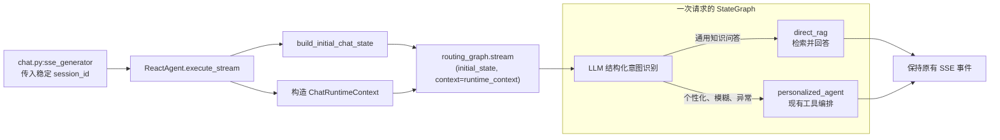
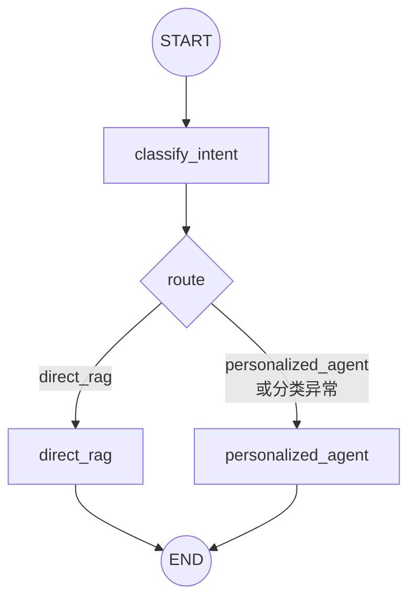
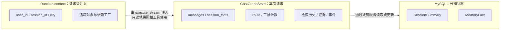

# LangGraph 路由编排设计

**状态：** 待确认  
**日期：** 2026-09-02

## 目标

将当前 `ReactAgent` 中通过关键词启发式决定“直接 RAG”或“个性化工具调用”的分支，替换为一个显式的 LangGraph 图。图使用短生命周期的 `GraphState` 保存本次对话运行中产生的状态；LLM 以结构化输出判断意图，并通过条件边选择分支。

对外行为保持兼容：`/api/chat` 的请求结构、SSE 事件类型与顺序、会话摘要和长期记忆的 MySQL 持久化方式均不改变。

## 一图看懂运行路径



## 现状与问题

- `app/services/react_agent.py` 的 `_should_use_direct_rag` 依赖中英文关键词，维护成本高，且容易将语义相近的提问分错路径。
- 直接 RAG 与完整 Agent 流程由同一个方法中的两套控制流实现，状态散落在局部变量、`run_context` 和工具层的 `ContextVar` 中。
- `MemoryFact`、`SessionSummary` 已由 MySQL 持久化；若额外引入 LangGraph Store，会形成两份长期记忆来源。

## 目标图



`direct_rag` 只用于无需用户个性化信息的、单一健身知识问答；`personalized_agent` 处理计划、饮食、伤病、训练记录、个人资料、记忆读取及任何意图不确定的提问。分类失败、LLM 返回不合规或超时均保守地落到 `personalized_agent`。

图调用前由入口适配层构造完整的初始状态：标准化消息、确定性提取的会话事实、会话摘要、空的检索历史/证据/事件列表和工具计数。这样 `classify_intent` 可以从首个图节点直接读取所需数据，避免一个只负责赋初值的额外节点。

## 状态与上下文边界

| 位置 | 允许内容 | 不允许内容 |
| --- | --- | --- |
| `ChatGraphState` | 标准化消息、会话事实、检索历史、路由结果、RAG 证据、工具预算、SSE 中间事件 | API 密钥、数据库连接、可被模型任意篡改的身份和权限 |
| `Runtime.context` | `user_id`、`session_id`、城市、追踪对象、依赖工厂等请求注入信息 | 会话摘要、跨请求共享的可变状态 |
| MySQL (`MemoryFact`、`SessionSummary`) | 长期记忆与可恢复的会话摘要 | 本次图执行的瞬态中间值 |

`GraphState` 只在一次 `execute_stream` 调用内有效，不启用 checkpointer 或 LangGraph Store。这样既能集中管理短期状态，又不会与现有数据库的长期记忆产生双写或读源冲突。

## Runtime.context 注入点

`Runtime.context` 只在 `ReactAgent.execute_stream` 的入口注入一次，图节点不自行创建或修改它：

```python
# app/services/react_agent.py::ReactAgent.execute_stream
initial_state = build_initial_chat_state(
    messages=messages,
    session_summary=session_summary,
)
runtime_context = ChatRuntimeContext(
    user_id=user_id,
    session_id=session_id,
    city=city,
    trace=trace,
    dependencies=...,
)

for event in self.routing_graph.stream(
    initial_state,
    context=runtime_context,
    stream_mode=...,
):
    yield adapt_event_to_existing_sse(event)
```

调用链为：`chat.py:sse_generator` 将稳定的 `session_id` 传入 `execute_stream`；后者统一构造 `ChatRuntimeContext` 并传给 `routing_graph.stream(..., context=...)`。图节点以 `runtime.context` 只读访问它；`personalized_agent` 节点调用内层 `create_agent` 时继续以 `context=runtime.context` 传递同一请求上下文。

### 状态归属图



## LLM 意图分类契约

分类节点使用现有 `ChatTongyi` 模型的 `with_structured_output`，返回受 Pydantic 校验的有限枚举，而不是解析自由文本：

```python
class IntentDecision(BaseModel):
    route: Literal["direct_rag", "personalized_agent"]
```

分类提示词只接收最后一条用户问题和脱敏后的必要会话事实；它不接收密钥、完整长期记忆或工具执行结果。分类理由若需记录，应为固定、可审计的分类标签，不把模型生成的长文本写入日志或状态。

## 迁移原则

1. 外层 `StateGraph` 负责路由与短期状态；内层已有 `create_agent` 暂保留为个性化分支的工具编排器，避免一次性重写全部工具。
2. 工具读取用户与会话信息时，逐步从进程级 `ContextVar` 迁移至 LangChain/LangGraph 的请求级运行时对象；不得让外部 SDK 类型进入核心状态模型。
3. 图通过自定义流输出或适配层转换为现有 JSON SSE 事件，事件 `tool`、`evidence`、`text`、`done` 的外部契约不得变化。
4. 分类器没有足够把握时必须选择个性化分支，宁可多一次工具编排，也不能遗漏伤病、饮食、目标等安全相关上下文。

## 验收标准

- 不再由 `_KNOWLEDGE_TERMS`、`_PERSONALIZATION_TERMS` 或 `_should_use_direct_rag` 决定路径。
- 普通知识问答走 `direct_rag`，涉及个人信息或不确定的问题走 `personalized_agent`。
- 结构化分类失败时不会中断聊天，且回退至个性化分支。
- 现有 `/api/chat` SSE 消费方无需修改。
- 单元测试不访问真实 LLM、数据库或天气 API；完整测试和静态检查通过。

## 参考

- [LangGraph Graph API](https://docs.langchain.com/oss/python/langgraph/graph-api)
- [LangChain Runtime context](https://docs.langchain.com/oss/python/langchain/runtime)
- [LangChain tools 与 ToolRuntime](https://docs.langchain.com/oss/python/langchain/tools)
