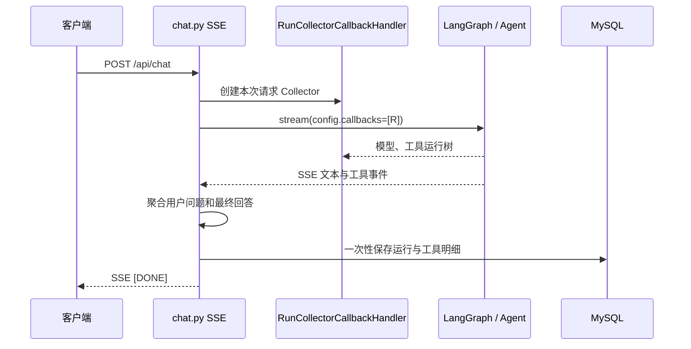

# 轻量本地 Agent 运行记录设计

**日期：** 2026-09-04  
**状态：** 已确认，待实施

## 目标与边界

将手写的 `AgentTrace` 替换为 LangChain 官方的 `RunCollectorCallbackHandler`，使一次聊天请求的运行记录可包含用户问题、最终模型回答、工具入参和工具输出，并继续只写入本地 MySQL。

本次不使用 LangSmith，不新增 Span/载荷表，不增加日志加密、保留期任务或新的管理端接口。已有会话级查询接口继续按会话归属鉴权；数据库访问权限仍是保存原文的唯一安全边界。

## 方案

`sse_generator` 为每轮请求创建一个 `RunCollectorCallbackHandler`，并通过 `RunnableConfig.callbacks` 传入路由图。LangGraph、内层 Agent、模型和工具产生的官方回调运行树仅在本次请求内保留。流结束后，HTTP 层已聚合的当前用户问题和最终回答连同 Collector 的工具运行记录，一次性投影到现有两张 MySQL 表。

Collector 只负责官方运行记录采集；仓储仍负责将其投影为项目稳定的数据库结构。这避免了把 LangChain 的 `Run` 类型泄漏到 API 或 ORM 层。

## 数据模型与接口

保留 `agent_runs` 和 `agent_tool_calls`，仅调整字段含义：

| 表 | 变更 | 含义 |
| --- | --- | --- |
| `agent_runs` | 新增 `user_question`、`assistant_answer` | 本轮请求问题与最终流式回答 |
| `agent_tool_calls` | `argument_shape` 重命名为 `tool_input` | Collector 中工具运行的真实输入，JSON 文本 |
| `agent_tool_calls` | `detail` 重命名为 `tool_output` | Collector 中工具运行的真实输出或错误，JSON 文本 |

`mode` 统一写为 `chat`，不再由手写追踪对象维护 `agent` / `direct_rag` 标志。`tool_call_count` 只统计工具运行；模型和图节点不单独成为 API 中的明细，避免记录噪声。

既有 `GET /api/sessions/{session_id}/agent-runs` 不变，只扩展响应字段为问题、回答、工具输入和工具输出。迁移保留旧行的数据：历史参数形状和摘要会分别留在改名后的字段中。

## 直接检索与工具识别

个性化 Agent 的工具调用由 LangChain 自动产生 `tool` 运行。直接 RAG 的检索构建步骤改用命名为 `rag_summarize` 的 `RunnableLambda` 包装，因此同样进入 Collector；仓储将它作为工具明细保存。模型调用、意图分类和图节点仍留在运行树中，但不投影为工具行。

## 失败与线程边界

运行记录在 SSE 消费结束或异常后由 `chat.py` 使用独立短生命周期数据库会话写入，继续遵循“记录失败不得影响用户已收到的 SSE”的现有行为。Collector 不直接访问数据库，因此不会跨 `run_in_executor` 工作线程复用请求数据库会话。

若请求在图开始前即失败或 Collector 没有可用根运行，仍保存一条 `failed` 或 `succeeded` 的运行摘要，工具数为零；不会伪造工具输入或输出。

## 代码边界

| 位置 | 调整 |
| --- | --- |
| `app/api/routers/chat.py` | 创建 Collector、传递回调配置、聚合后调用仓储。 |
| `app/services/react_agent.py` | 接收并透传 `RunnableConfig`；直接 RAG 使用可追踪 Runnable。 |
| `app/services/chat_routing_graph.py` | 向执行节点传递运行配置，移除 `trace` 上下文。 |
| `app/services/middleware.py` | 删除 `AgentTrace` 的手工工具记录，保留预算与业务日志。 |
| `app/services/agent_trace.py` | 删除。 |
| `app/repositories/agent_trace_repository.py` | 从 Collector 的工具运行投影为 ORM 行，不依赖手写 Trace。 |
| `app/models.py`、`app/schemas.py`、Alembic | 对齐新字段与兼容查询响应。 |

## 验证

测试必须覆盖：

1. Collector 的嵌套工具运行被稳定按开始顺序投影，且保存真实输入、输出和异常。
2. SSE 成功与异常路径均保存用户问题、最终回答、状态和工具数量。
3. 直接 RAG 的 `rag_summarize` 会被 Collector 记录。
4. `ChatRuntimeContext` 和中间件不再持有或引用 `AgentTrace`。
5. 迁移可从当前 Alembic 头版本升级；既有会话查询接口能序列化新字段。

范围内的测试通过后，运行 Ruff 检查和格式检查；全量测试如遇既有环境警告会单独报告，不能掩盖本次测试结果。
